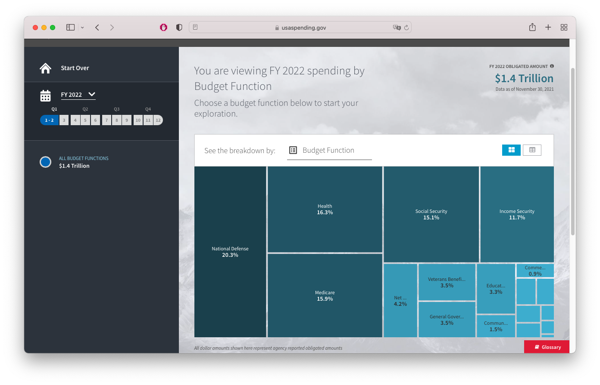
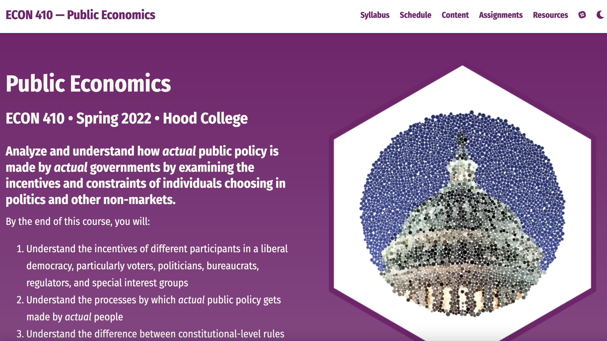
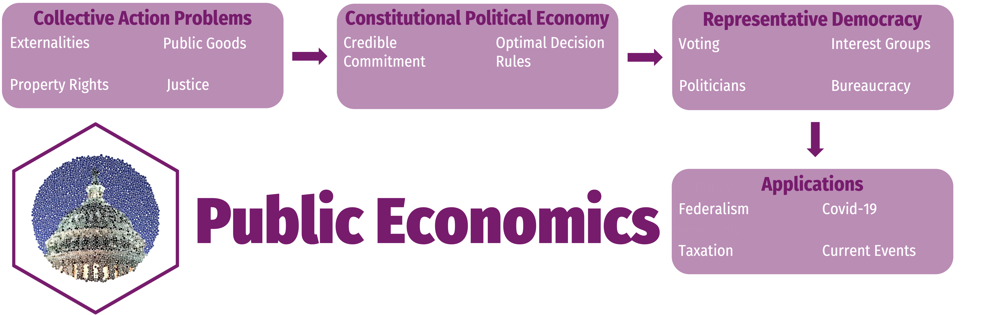

```{r setup, include=FALSE}
options(htmltools.dir.version = FALSE)
knitr::opts_chunk$set(echo=F,
                      message=F,
                      warning=F,
                      fig.retina = 3,
                      fig.align = "center")
library("tidyverse")
library("ggrepel")
library("fontawesome")
xaringanExtra::use_tile_view()
xaringanExtra::use_tachyons()
xaringanExtra::use_freezeframe()

update_geom_defaults("label", list(family = "Fira Sans Condensed"))
update_geom_defaults("text", list(family = "Fira Sans Condensed"))

set.seed(256)

theme_slides <- theme_light() + 
  theme(
    text = element_text(family = "Fira Sans", size = 24)
  )

```

```{r}
library(wbstats)
library(fredr)
fredr_set_key("9100cdf3c862283007d8c83ce02059e6")
```

class: inverse

# Outline

### [Review: The Benefits of Markets](#)
### [When We Must Choose in Groups](#)
### [About This Course](#)

---

# About Me

.left-column[
.center[


.smallest[
Edinburgh, 2019
]
]
]

.right-column[
.smallest[

- Ph.D (Economics) — George Mason University, 2015

- B.A. (Economics) — University of Connecticut, 2011

- Specializations:
  - Law and Economics
  - Austrian Economics

- Research interests
  - modeling innovation & economic growth
  - political economy & economic history of intellectual property
]
]

---

# About Me

.left-column[
.center[


.smallest[
My face without a mask, 2021
]
]
]

.right-column[
.smallest[

- Ph.D (Economics) — George Mason University, 2015

- B.A. (Economics) — University of Connecticut, 2011

- Specializations:
  - Law and Economics
  - Austrian Economics

- Research interests
  - modeling innovation & economic growth
  - political economy & economic history of intellectual property

]
]

---

# The Reason I am Busy AF Behind the Scenes


.center[

]

And why I wear a mask.
---

# Public Economics

.right-column[

- .hi[How do we choose in groups?]
  - Going to dinner together
  - Electing a president of the United States

- .hi[“Public choice”]: application of .hi-purple[economic tools] to the study of .hi-purple[politics]
  - “Non-market decision-making”
]

.left-column[

.center[

]
]

---

# Economics as a *Way of Thinking*

.pull-left[

- Economics is a .hi[way of thinking] based on a few core ideas:
]

---

# Economics as a *Way of Thinking*

.pull-left[

- Economics is a .hi[way of thinking] based on a few core ideas:

- .hi-purple[People respond to incentives]
    - Money, punishment, taxes and subsidies, risk of injury, reputation, profits, sex, effort, morals

]

.pull-right[

.center[

]
]

---

# Economics as a *Way of Thinking*

.pull-left[

- Economics is a .hi[way of thinking] based on a few core ideas:

- .hi-purple[People respond to incentives]
    - Money, punishment, taxes and subsidies, risk of injury, reputation, profits, sex, effort, morals

- .hi-purple[Environments adjust until they are in equilibrium]
    - People make adjustments until their choices are optimal given others’ actions
]

.pull-right[

.center[


]
]

---

# Optimization and Equilibrium

.pull-left[
- If people can *learn* and *change* their behavior, they will always switch to a higher-valued option

- If there are no alternatives that are better, people are at an .hi[optimum]

- If **everyone** is at an optimum, the system is in .hi[equilibrium]
]

.pull-right[
.center[


]
]

---

# The Two Major Models of Economics as a "Science"

.pull-left[

## Optimization

- Agents have .hi[objectives] they value

- Agents face .hi[constraints]

- Make .hi[tradeoffs] to maximize objectives within constraints

.center[

]
]

--

.pull-right[

## Equilibrium

- Agents .hi[compete] with others over **scarce** resources

- Agents .hi[adjust] behaviors based on prices

- .hi[Stable outcomes] when adjustments stop

.center[

]

]

---

# Economics Is Broader Than You Think

.center[

]


---

class: inverse, center, middle

# Review: The Benefits of Markets

---

# Economics

.pull-left[
- **Economics** begins with .hi[interaction] between *multiple* people

- Recognizing .hi-purple[mutual gains from cooperation]
  - Specialization
  - Exchange
  - Team production
]

.pull-right[
.center[

]
]

---

# The Origins of Exchange I

.pull-left[
- Why do we trade?

- .hi[Resources are in the wrong place!]

- People have *better* uses of resources than they are currently being used! 

]

.pull-right[
.center[

]
]

---

# The Origins of Exchange II

.pull-left[
- *Why* are resources in the wrong place?

- .hi[We have the same stuff but different preferences]


]

.pull-right[
.center[


]
]

---

# The Origins of Exchange III

.pull-left[
- *Why* are resources in the wrong place?

- .hi[We have different stuff and same/different preferences]

]

.pull-right[
.center[


]
]

---

# Transaction Costs and Exchange I

.pull-left[
- But .hi[Transaction costs] make exchange costly!
  - .hi-purple[Search costs]
  - .hi-purple[Bargaining costs]
  - .hi-purple[Enforcement costs]
]

.pull-right[
.center[

]
]

---

# Transaction Costs and Exchange II

.pull-left[
- With high transaction costs, resources **cannot** be traded

- Resources **cannot** be moved to higher-valued uses

- If other people value goods higher than their current owners, resources are **inefficiently** used!
]

.pull-right[
.center[

]
]

---

# Social Problems that Markets Solve Well 

.pull-left[
- **Problem 1**: Resources have multiple uses and are rivalrous

- **Problem 2**: Different people have different subjective valuations for uses of resources

- **It is inefficient (immoral?) to use a resource in a way that prevents someone else who values it more from using it!**

]

.pull-right[
.center[

]
]

---

# Social Problems that Markets Solve Well I

.pull-left[

- .hi[Markets] are institutions that facilitate voluntary *impersonal* exchange and reduce transaction costs

- **Prices** measure **opportunity cost** of a particular use of a resource
]

.pull-right[
.center[

]
]

---

# Social Problems that Markets Solve Well II

.pull-left[
- .hi[Property rights] provide a pattern of ownership

- .hi[Prices] give us information about how to use scarce resources

- .hi[Profits] incentivize production and .hi[Losses] discipline waste
]

.pull-right[
.center[

]
]

---

# Prices are Signals

.pull-left[
.center[

]
]

.pull-right[
.smallest[
- .hi-purple[Markets are social *processes* that generate information via prices]

- .hi-purple[Prices are never "given"], prices .hi-purple[emerge] dynamically from negotiation and market decisions of entrepreneurs and consumers

- **Competition**: is a .hi-purple[discovery process] which *discovers* what consumer preferences are and what technologies are lowest cost, and how to allocate resources accordingly

]
]

---

# The Social Functions of Prices I

.pull-left[

.center[

]
]

.pull-right[
.smaller[
A relatively high price:

- .hi-purple[Conveys information]: good is relatively scarce

- .hi-purple[Creates incentives for]:
  - **Buyers**: conserve use of this good, seek substitutes
  - **Sellers**: produce more of this good
  - **Entrepreneurs**: find substitutes and innovations to satisfy this unmet need
]
]

---

# The Social Functions of Prices II

.pull-left[

]

.pull-right[

.smaller[
A relatively low price

- .hi-purple[Conveys information]: good is relatively abundant

- .hi-purple[Creates incentives for]:
  - **Buyers**: substitute away from expensive goods towards this good
  - **Sellers**: Produce less of this good, talents better served elsewhere
  - **Entrepreneurs**: talents better served elsewhere: find more severe unmet needs

]
]

---

class: inverse, center, middle

# When We Must Choose in Groups

---

# When We Must Choose in Groups I

.pull-left[

- Markets allocate resources by **individual choices** between **strangers**

- Possibilities of .hi[market failure]
  - Externalities
  - Public Goods
]

.pull-right[
.center[

]
]

---

# When We Must Choose in Groups II

.pull-left[

- Circumstances where people must make a **collective choice** or **know each other**
  - Justice, fairness, equality
  - Team production, public goods

]

.pull-right[
.center[

]
]

---

# When We Must Choose in Groups III

.pull-left[

- Construct a **framework** for markets to operate within
  - Property rights
  - Transaction costs
  - Regulation
]

.pull-right[
.center[

]
]

---

# Methodological Individualism

.pull-left[

- .hi[Only individual people act]

- The individual is the base unit of all economic analysis

- *"How will action / choice / policy / institution [X] affect each individual's well-being?"*
]

.pull-right[

.center[

]
]

---

# *Groups* Don't Choose

.pull-left[

- .hi[“Society”] is not a choosing-agent or an optimization problem

- Individuals have **different interests** in their different capacities
  - Consumers
  - Producers
  - Voters
  - Interest groups
  - Elected officials
  - Bureaus
]

.pull-right[
.center[

]
]

---

# They Must Choose In a Unique Environment

.pull-left[

- No .hi[property rights]

- No .hi[prices]

- No .hi[profits or losses]

]

.pull-right[
.center[

]
]

---

# The "Public Sector"

.pull-left[

- Activities by government(s) occupy a large part of the economy

- A major function of economists is to analyze and suggest public policy

- Positive vs. normative economics

]

.pull-right[
.center[

]
]

---

# U.S. Federal Spending as % of GDP

```{r, fig.width=14}
spending<-fredr(
  series_id = "FYONGDA188S"
)

ggplot(data = spending)+
  aes(x = date,
      y = value,
      color = series_id)+
  geom_path(size=2)+
  scale_x_date(date_labels = "%Y", breaks = "10 years")+
  scale_y_continuous(breaks=seq(0,50,5),
               labels=function(x){paste0(x,"%")})+
  labs(x = "Year",
       y = "Total Federal Spending (% of GDP)",
       caption = "Source: FRED")+
  guides(color=F)+
  theme_slides
```

---

# U.S. Federal Revenues as % of GDP

```{r, fig.width=14}
taxrev<-fredr(
  series_id = "FYFRGDA188S"
)

ggplot(data = taxrev)+
  aes(x = date,
      y = value,
      color = series_id)+
  geom_path(size=2)+
  scale_x_date(date_labels = "%Y", breaks = "10 years")+
  scale_y_continuous(breaks=seq(0,30,5),
               labels=function(x){paste0(x,"%")})+
  labs(x = "Year",
       y = "Total Federal Revenues (% of GDP)",
       caption = "Source: FRED")+
  guides(color=F)+
  theme_slides
```

---

# U.S. Federal Budget Surplus/Deficit as % of GDP

```{r, fig.width=14}
deficit<-fredr(
  series_id = "FYFSGDA188S"
)

ggplot(data = deficit %>% slice(-1))+
  aes(x = date,
      y = value,
      color = series_id)+
  geom_path(size=2)+
  geom_hline(yintercept=0, size=1)+
  scale_x_date(date_labels = "%Y", breaks = "10 years")+
  scale_y_continuous(breaks=seq(-30,10,5),
               labels=function(x){paste0(x,"%")})+
  labs(x = "Year",
       y = "Budget Surplus or Deficit (% of GDP)",
       caption = "Source: FRED")+
  guides(color=F)+
  theme_slides
```

---

# U.S. Total Public Debt as % of GDP

```{r, fig.width=14}
debt<-fredr(
  series_id = "GFDEGDQ188S"
)

ggplot(data = debt)+
  aes(x = date,
      y = value,
      color = series_id)+
  geom_path(size=2)+
  scale_x_date(date_labels = "%Y", breaks = "10 years")+
  scale_y_continuous(breaks=seq(30,140,10),
               labels=function(x){paste0(x,"%")})+
  labs(x = "Year",
       y = "Debt (% of GDP)",
       caption = "Source: FRED")+
  guides(color=F)+
  theme_slides
```

---

# U.S. Federal Spending Breakdown

.center[

]

.source[Source: [USAspending.gov](https://www.usaspending.gov/#/explorer/budget_function)]

---

# Motivations I

.center[

]

---

# Motivations II

.center[

]

---

# Motivations III

.center[

]


---

# Learning Goals I

- Understand the incentives of different participants in a liberal democracy, particularly voters, politicians, bureaucrats, regulators, and special interest groups

- Understand the processes by which *actual* public policy gets made by *actual* people

- Understand the difference between constitutional-level rules and political rules and the importance of each

---

# Learning Goals II

- Explain current events and public policies in terms of individuals accomplishing separate political goals through political exchanges

- Recognize the analytical and practical similarities and differences between individuals acting in markets and non-market institutions

- Understand and explain real world differences in outcomes and in operations between political, cultural, economic, and social institutions in different societies

- Overcome the nirvana fallacy

---

# Politics Without Romance


.pull-left[
.center[

]
]

.pull-right[

- We will make your high school civics teacher proud

]

---

# Politics Without Romance


.pull-left[
.center[

]
]

.pull-right[

- We will make your high school civics teacher proud and cry

]

---

# Politics Without Romance

.pull-left[

> What's so great about democracy other than its democratic? - Gordon Tullock

> Democracy is the worst form of government, except for all the other forms that have been tried from time to time," - Winston Churchill

]

.pull-right[
.center[

]
]

---

class: inverse, center, middle

# About This Course

---

# Format For the Course

.pull-left[

- .hi[This is a 400-level seminar]

- A .hi-purple[conversation], not *just* a lecture
  - Lectures to introduce topic, give background and context
  - Readings-based discussions

]

.pull-right[
.center[

]
]

---

# Assignments

```{r}

assignments <- tribble(
  ~"",  ~Assignment, ~Percent,
  "n"     , "Participation (Average)", "30%",
  "1", "Policy Paper", "30%",
  "1"      , "Take-Home Midterm", "20%",
  "1"     , "Take-Home Final", "20%"
)
knitr::kable(assignments, "html")
```

.center[
See more details at the [assignments page](/assignments)
]

---

# Your "Textbooks"

.pull-left[
.center[

]
]
.pull-right[
.center[

]
]

---

# Mechanics

- Office Hours: MW 3:30-5:00PM

- Email: safner@hood.edu

- *New* Room Location: Rosenstock 317?

- Readings pages on website

- .hi-purple[First reading] for next class (.hi[Monday Jan 31]): Coase (1960)
  - Email 2-3 questions to me before class begins
  - See more about our discussions on [Assignments Page](/assignments)

---

# Course Website

.center[


[publicS22.classes.ryansafner.com](http://publicS22.classes.ryansafner.com)
]

---

# Logistics

.pull-left[
.smallest[

- Office hours: TBD & by appt
  - Office: 110 Rosenstock

- `r fa("slack", fill ="#5E81AC")` Slack channel
  - `#c-econ-410-public`

- Covid/Zoom policy, attendance

- See the [resources page](http://publicS22.classes.ryansafner.com/resources) for tips for success and more helpful resources
]
]
.pull-right[
.center[

]
]

---

# Roadmap for the Semester

.center[

]
