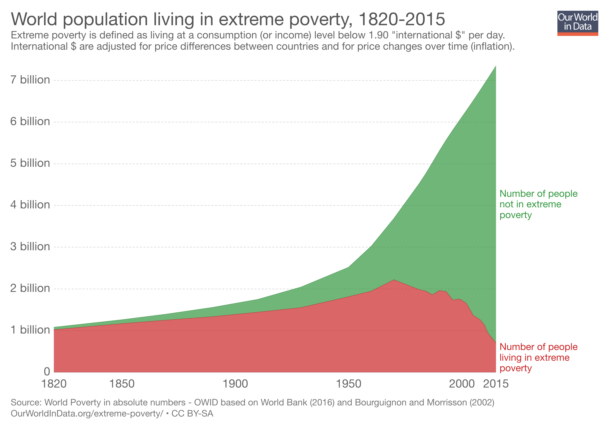
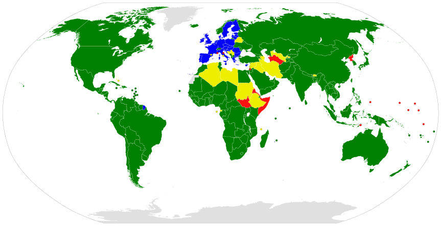
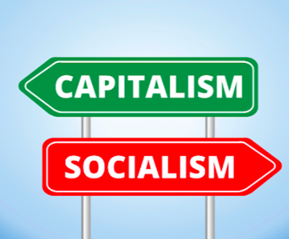
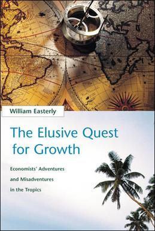

```{r setup, include=FALSE}
options(htmltools.dir.version = FALSE)
knitr::opts_chunk$set(echo=F,
                      message=F,
                      warning=F,
                      fig.retina = 3,
                      fig.align = "center")
library("tidyverse")
library("ggrepel")
library("fontawesome")
xaringanExtra::use_tile_view()
xaringanExtra::use_tachyons()
xaringanExtra::use_freezeframe()

update_geom_defaults("label", list(family = "Fira Sans Condensed"))
update_geom_defaults("text", list(family = "Fira Sans Condensed"))

set.seed(256)

theme_slides <- theme_light() + 
  theme(
    text = element_text(family = "Fira Sans", size = 24)
  )

```

class: inverse

# Outline

### [The Big Questions](#)
### ["Development Economics" as a Field of Economics](#)
### [Residues of 20th Century Geopolitics in Development](#)
### [About This Course](#)

---

# About Me

.left-column[
.center[


.smallest[
Edinburgh, 2019
]
]
]

.right-column[
.smallest[

- Ph.D (Economics) — George Mason University, 2015

- B.A. (Economics) — University of Connecticut, 2011

- Specializations:
  - Law and Economics
  - Austrian Economics

- Research interests
  - modeling innovation & economic growth
  - political economy & economic history of intellectual property
]
]

---

# About Me

.left-column[
.center[


.smallest[
My face without a mask, 2021
]
]
]

.right-column[
.smallest[

- Ph.D (Economics) — George Mason University, 2015

- B.A. (Economics) — University of Connecticut, 2011

- Specializations:
  - Law and Economics
  - Austrian Economics

- Research interests
  - modeling innovation & economic growth
  - political economy & economic history of intellectual property

]
]

---

# The Reason I am Busy AF Behind the Scenes


.center[

]

And why I wear a mask.
---

# The "Great Fact" I

<iframe src="https://ourworldindata.org/grapher/maddison-data-gdp-per-capita-in-2011us-single-benchmark" loading="lazy" style="width: 100%; height: 500px; border: 0px none;"></iframe>

.source[Source: [Our World in Data: Economic Growth](https://ourworldindata.org/economic-growth)]

---

# The "Great Fact" II

<iframe src="https://ourworldindata.org/grapher/average-real-gdp-per-capita-across-countries-and-regions" loading="lazy" style="width: 100%; height: 500px; border: 0px none;"></iframe>

.source[Source: [Our World in Data: Economic Growth](https://ourworldindata.org/economic-growth)]

---

# Self-Sufficiency...and Poverty 

.center[

]

---

# Where We ALL Began

.left-column[
.center[


Dierdre N. McCloskey

1942-
]
]

.right-column[
.smallest[
Two centuries ago the world’s economy stood at the present level of Chad or Bangladesh. In those good old days of 1800...the average human consumed in modern-day prices...roughly $3 a day, give or take a dollar or two...The only people much better off than the $3 average were lords or bishops or some few of the merchants. It had been this way for all of history, and for that matter all of pre-history. With her $3, the typical denizen of the earth could eat a few pounds of potatoes, a little milk, very occasionally a scrap of meat. A wool shawl. A year or two of elementary education, if exceptionally lucky. At birth she had a 50-50 chance of dying before she was 30 years old. Perhaps she was a cheerful sort, and was "happy" with illiteracy, disease, superstition, periodic starvation, and lack of prospects. After all, she had her family and faith and community, which interfered with every choice she made. But anyway she was desperately poor, and narrowly limited in human scope. (pp. 11-12)
]


.source[McCloskey, Diedre N, 2010, *The Bourgeois Dignity: Why Economics Can't Explain the Modern World*, Chicago IL: University of Chicago Press]
]
---

# Complete Interdependence...and Prosperity 

.center[

]

---

# We've Come SO Far


.left-column[
.center[


Dierdre N. McCloskey

1942-
]
]

.right-column[

.smallest[
> [Today] the world supports more than six-and-a-half times more people...the average person today earns and consumes almost ten times more goods and services than in 1800. Real income per person in the world has recently been doubling every generation, and is accelerating. Starvation worldwide therefore is at an all-time low, and falling. Literacy and life expectancy are at all-time highs, and rising. Liberty is spreading. Slavery is retreating, as is a patriarchy enslaving of women. In the richer countries, such as Norway, the average person earns fully 45 times more than in 1800, a startling $137 a day. The environment - a concern of a well-to-do bourgeoisie - is in such rich places improving. (pp. 11-12)
]

.source[McCloskey, Diedre N, 2010, *The Bourgeois Dignity: Why Economics Can't Explain the Modern World*, Chicago IL: University of Chicago Press]
]
---

# The Greatest Reduction of Poverty in Human History I

.center[

]

.source[Source: [Our World in Data: Extreme Poverty](https://ourworldindata.org/extreme-poverty)]

---

# The Greatest Reduction of Poverty in Human History II

.center[

]

.source[Source: [Our World in Data: Extreme Poverty](https://ourworldindata.org/extreme-poverty)]

---

# The Big Question I

.center[

]

.source[[Map Source](http://i.imgur.com/3GJJ8b0.png); [IMF Data & Interactive Map](https://data.worldbank.org/indicator/ny.gdp.pcap.cd?type=shaded&view=map)]

---

# The Big Question II

.center[

]

.source[Gallup, J. L., J. D. Sachs, and A. D. Mellinger, 1999, "Geography and Economic Development," *International Regional Science Review* 22(2):179-224; [Land of Maps](https://landofmaps.com/2015/02/18/world-gdp-density/)]

---

# The Big Question III

.center[

]

.source[Gallup, J. L., J. D. Sachs, and A. D. Mellinger, 1999; [Wikipedia](https://en.wikipedia.org/wiki/File:World_population_density_1994_-_with_equator.png); [A Great Interactive Version](http://luminocity3d.org/WorldPopDen/)]

---

# Asking the Big Questions 

.left-column[
.center[


Adam Smith

1723-1790
]
]
.right-column[

> The greatest improvement in the productive powers of labour, and the greater part of the skill, dexterity, and judgment with which it is any where directed, or applied, seem to have been the effects of the division of labour. (Book I, Chapter I)

]

.source[Smith, Adam, 1776, *An Enquiry into the Nature and Causes of the Wealth of Nations*]

---

# Asking the Big Questions II

.left-column[
.center[


Adam Smith

1723-1790
]
]
.right-column[

> The natural effort of every individual to better his own condition...is so powerful, that it is alone, and without any assistance, not only capable of carrying on the society to wealth and prosperity, but of surmounting a hundred impertinent obstructions with which the folly of human laws too often encumbers its operations. (Book IV, Chapter V)

]

.source[Smith, Adam, 1776, *An Enquiry into the Nature and Causes of the Wealth of Nations*]

---

# Asking the Big Questions III

.left-column[
.center[


Adam Smith

1723-1790
]
]
.right-column[

> Little else is requisite to carry a state to the highest degree of opulence from the lowest barbarism, but peace, easy taxes, and a tolerable administration of justice: all the rest being brought about by the natural course of things.

]

.source[Lecture in 1755, quoted in Dugald Stewart, *Account Of The Life And Writings Of Adam Smith LLD*, Section IV, 25.]

---

class: inverse, center, middle

# "Development Economics" as a Field of Economics

---

# "Development Economics" as a Field (c. 1945-Present)

.pull-left[
.smallest[
- United Nations Monetary and Financial Conference aka "Bretton Woods" (1944)

- Create the international monetary and financial order post-WWII, promote free trade and monetary stability

- Created a system of fixed currency exchange rates pegged to (initially gold, later just the U.S. dollar)
    - This collapsed by the early 1970s, and today exchange rates are freely "floating"

- Created key international organizations...
]
]
.pull-right[

.center[

]
]

---

# "Development Economics" as a Field (c. 1945-Present)

.pull-left[

- International Bank for Reconstruction and Development (IBRD) aka ".shout[the World Bank]"
    - Offers loans to developing countries

- .shout[International Monetary Fund (IMF)]
    - Reduce poverty around the world; assist countries with balance of payments/financial crises

]

.pull-right[

.center[

]
]

---

# "Development Economics" as a Field (c. 1945-Present)

.pull-left[

- 1947: General Agreement on Tariffs and Trade (GATT)
    - to promote international trade by reducing or eliminating trade barriers (e.g. tariffs, quotas, etc) between countries

- Replaced by the World Trade Organization (WTO) in 1995 administered by the U.N.
]

.pull-right[

.center[


]
]

---

# "Development Economics" as a Field (c. 1945-Present)

.center[


WTO .green[members], .blue[members dually-represented by the E.U.], .yellow[Observers], .red[Non-members] ([Wikipedia](http://en.wikipedia.org/wiki/World_Trade_Organization))
]

---

# The "Development Community" I

.right-column[
.smallest[
- 1948: Organisation for European Economic Co-operation (OECD) to administer the U.S. Marshall Plan to rebuild war-torn Europe
    - initially only Europe-oriented and European members
    - helped in early stages of ultimately creating European Free Trade Area, European Economic Community, European Union
- 1961: Organization for Economic Co-operation and Development (OECD)

> ...an international organisation that works to build better policies for better lives. Our goal is to shape policies that foster prosperity, equality, opportunity and well-being for all...we work on establishing international norms and finding evidence-based solutions to a range of social, economic and environmental challenges...we provide a unique forum and knowledge hub for data and analysis, exchange of experiences, best-practice sharing, and advice on public policies and global standard-setting. ([OECD website](http://www.oecd.org/about/))

]
]
.left-column[

.center[

]
]

---

# The "Development Community" II

.center[


OECD members, founding States in darker blue ([Wikipedia](https://en.wikipedia.org/wiki/OECD))

]

---

# NGOs

.center[

]

---

class: inverse, center, middle

# Residues of 20<sup>th</sup> Century Geopolitics in Development

---

# Development and Colonial Legacies I

.center[


Western colonial empires at the end of WWII ([Wikipedia](https://en.wikipedia.org/wiki/Cold_War#/media/File:Colonization_1945.png))
]

---

# Development and Colonial Legacies I

.pull-left[

- Breakup of British and French empires create independent States from 1950s-1980s

- Some outright wars
    - Between colony and colonizer: Algeria, French-Indochina/Vietnam, Falklands
    - Between rival groups across colonies: Arab-Israeli War, Indo-Pakistani Wars
    - Civil Wars in poorly-designed new States in Africa

]

.pull-right[

.center[

]
]

---

# Development and Colonial Legacies II

.pull-left[
.smallest[
- Postcolonialism in literature in culture of many former colonies
    - Search for own national identity, nationalist/populist leaders
    - Opposition of mother country's culture, racism

- New countries need to develop, but
    - Does "development" or "modernization" mean "Westernization?"

- Often combined with Marxism

]
]
.pull-right[

.center[


]
]

---

# Development and Colonial Legacies III

.center[


Gamal Abdel Nasser (Egypt), Sukarno (Indonesia), Jawaharlal Nehru (India), Kwame Nkrumah (Ghana)
]

---

# Development and Colonial Legacies IV

.pull-left[

- There is still a lot of connection between former colonies and mother countries

- Research shows a very strong influence on path of economic development

- Was colonization and imperialism *all good/bad*? 

]

.pull-right[

.center[

]
]

---

# Development and the Cold War

.center[


Cold War Alliances, "X"s' indicate prominent guerrilla movements ([Wikipedia](https://commons.wikimedia.org/wiki/File:Cold_War_Map_1980.svg))
]

---

# Development and the Cold War: Competing Visions

.pull-left[
.smaller[
- Competing ideological visions of political/economic development 
    - "Capitalism" of the West
    - "Socialism" of the USSR, Yugoslavia, China

- Countries would pick from both options, many would switch
    - Consequences were pretty clear, but
    - We will need to understand both theories of development
    - What about "Democratic Socialism" or "Social Democracy"?
]
]
.pull-right[

.center[

]
]

---

# There Are a LOT of Theories of Development Out There

.pull-left[

- Nobody honestly believes in a single causal factor

- Theories have emphasized different elements at different amounts:
    - Capital accumulation
    - Geography
    - Health
    - Demographics/Fertility
    - Education
    - Culture
    - Warfare
    - Political institutions
    - Religion
    - Foreign Aid
    - Imperialism/exploitation
]

.pull-right[

.center[

]
]

---

# There Are a LOT of Theories of Development Out There 

.center[

]

---

# Our Focus (and my Specialty)

.pull-left[
- The role of political and social institutions in fostering economic growth

- Health, education, demographics, geography, foreign aid, etc amount to NOTHING if you have poor institutions!

- We know what works, but we can't just transplant our institutions to other countries (we've tried)

- We need to understand each country's institutions before we can tell cute stories or recommend changes
]

.pull-right[
.center[

]

]

---

# What am I Leaving Out

.center[

]

---

class: inverse, center, middle
# About This Class

---

# Format For the Course

.pull-left[
- .shout[A conversation, not a lecture]<sup>1<sup>

- Many suggestions but fewer "correct" and concrete answers than you are used to

- Lectures to introduce topic, give background and context

- Discussions based on readings & informed by lectures

]

.pull-right[
.center[

]
]

.footnote[<sup>1</sup> Well, okay, I will lecture a fair amount. But please come as a willing participant.]

---

# Assignments

```{r}
library("tidyverse")
assignments <- tribble(
  ~"",  ~Assignment, ~Percent,
  "n"     , "Participation (Average)", "25%",
  "1", "Country Profile", "5%",
  "2"      , "Short Paper", "15% each",
  "1"     , "Final", "30%"
)
knitr::kable(assignments, "html")
```

.center[
See more details at the [assignments page](http://devf21.classes.ryansafner.com/assignments)
]

---

# Your "Textbooks"

.pull-left[
.center[

]
]
.pull-right[
.center[

]
]

---

# Course Website

.center[


[devF21.classes.ryansafner.com](http://devf21.classes.ryansafner.com)
]

---

# Logistics

.pull-left[
.smallest[

- Office hours: M/W 10:00-11:00 AM & by appt
  - Office: 110 Rosenstock

- `r fa("slack", fill ="#5E81AC")` Slack channel
  - `#c-3econ-16-dev`

- Recorded videos in Blackboard Panopto

- Attendance

- See the [resources page](http://devF21.classes.ryansafner.com/resources) for tips for success and more helpful resources
]
]
.pull-right[
.center[

]
]

---

# Roadmap for the Semester

.center[

]
