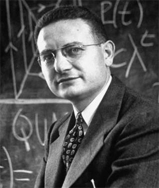
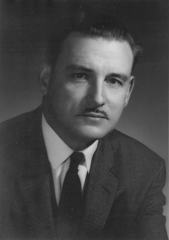
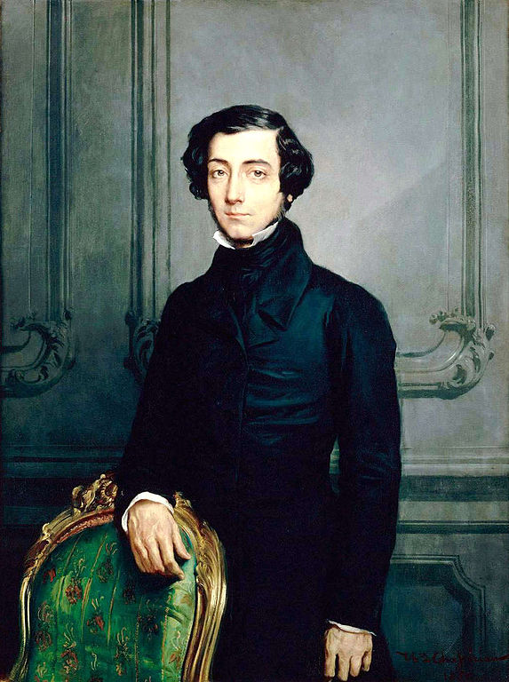
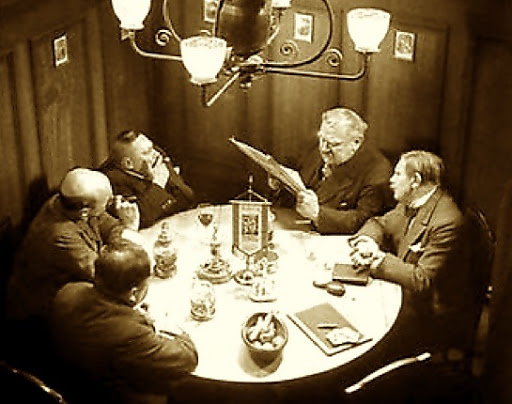

```{r setup, include=FALSE}
options(htmltools.dir.version = FALSE)
knitr::opts_chunk$set(echo=F,
                      message=F,
                      warning=F,
                      fig.retina = 3,
                      fig.align = "center")
library("tidyverse")
library("ggrepel")
library("fontawesome")
xaringanExtra::use_tile_view()
xaringanExtra::use_tachyons()
xaringanExtra::use_freezeframe()

update_geom_defaults("label", list(family = "Fira Sans Condensed"))
update_geom_defaults("text", list(family = "Fira Sans Condensed"))

set.seed(256)

theme_slides <- theme_light() + 
  theme(
    text = element_text(family = "Fira Sans", size = 24)
  )

```


class: inverse, center, middle

# Public Goods

---

# Public Goods

.left-column[
.center[


.smallest[
Paul A. Samuelson

1915-2009

Economics Nobel 1970
]
]
]

.right-column[

> “.hi[Collective consumption goods] [are those where] all enjoy in common in the sense that each individual's consumption of such a good leads to no subtractions from any other individual's consumption of that good...” (p.387).


.source[Samuelson, Paul A, 1954, “A Pure Theory of Public Expenditures,” *Review of Economics and Statistics* 36(4): 387-89]
]

---


# Public Goods

.left-column[
.center[


.smallest[
Paul A. Samuelson

1915-2009

Economics Nobel 1970
]
]
]

.right-column[

> “*[N]o decentralized pricing system can serve to determine optimally these levels of collective consumption*. Other kinds of “voting” or “signalling” would have to be tried. But...it is in the selfish interest of each person to give *false* signals, to pretend to have less interest in a given collective consumption activity than he really has, etc.” (pp.388—389, emphasis in original).

.source[Samuelson, Paul A, 1954, “A Pure Theory of Public Expenditures,” *Review of Economics and Statistics* 36(4): 387-89]
]

---

# Public Goods

.pull-left[
.center[

]
]

.pull-right[

- .hi[Public Good]: a good that is .hi-purple[non-rival] and .hi-purple[non-excludable]

- .hi-purple[Rivalry]: one use of a resource removes it from other uses

- .hi-purple[Excludability]: ability or right to prevent others from using it (ownership)

]

---

# The Free Rider Problem

.pull-left[
- Individual bears a **private cost to contribute**, but only gets a **small fraction of the (dispersed) benefit** of a good

- If individuals can gain **access** to the good (nonexcludable) **without paying**, may lead to...

- .hi[Free riding]: individuals consume the good without paying for it
]

.pull-right[
.center[

]
]

---

# Examples?

.pull-left[
.center[

]
]

.pull-right[
.center[

]
]

- Are these truly non-rival and non-excludable?

---

# Market Failure from Public Goods

.pull-left[

- No incentive for people to contribute and pay for the good

- If enough people obtain the benefits without incurring the costs...

- **Not profitable** for private market actors to supply it

]

.pull-right[
.center[

]
]

---

# Adam Smith on Public Goods

.left-column[
.center[


.smallest[
Adam Smith

1723-1790
]
]
]
.right-column[

.smallest[
> “The third and last duty of the sovereign or commonwealth is that of .hi[erecting and maintaining those public institutions and those public works], which, though they may be in the highest degree advantageous to a great society, are, however, .hi[of such a nature that the profit could never repay the expence to any individual or small number of individuals], and which it therefore .hi[cannot be expected that any individual or small number of individuals should erect or maintain]. The performance of this duty requires, too, very different degrees of expence in the different periods of society,” (Book VI, Ch. 9).

]

.source[Smith, Adam, 1776, *An Enquiry into the Nature and Causes of the Wealth of Nations*]

]

---

# Public Goods $\neq$ “Good for the Public”

```{r, fig.width=12}
red_pink <- "#e64173"
blue <- "#2b59c3"

venn_colors <- c(red_pink, blue)
venn_lines <- rep("solid", 10)
# Locations of circles
venn_df <- tibble(
  x  = c( 0.0,   2.0),
  y  = c( 0.0,   0.0),
  r  = c( 2.0,   2.0),
  l  = c( "Things Governments \n Provide", "Public Goods"),
  xl = c( -1.0,    3.0),
  yl = c( 0.0,   0.0))
# Venn
ggplot(data = venn_df, aes(x0 = x, y0 = y, r = r, fill = l, color = l)) +
ggforce::geom_circle(aes(linetype = l), alpha = 0.3, size = 0.75) +
theme_void() +
theme(legend.position = "none") +
scale_fill_manual(values = venn_colors) +
scale_color_manual(values = venn_colors) +
scale_linetype_manual(values = venn_lines) +
  geom_text(aes(x = xl, y = yl, label = l), size = 8, family = "Fira Sans Condensed") +
coord_equal()
```


.source[Safner, 2021, “‘Public Good’ or ‘Good for the Public?’ Political Entrepreneurship and the Public Funding of Scientific Research,” *Journal of Private Enterprise* 36(1): 17-44]

---

class: inverse, center, middle

# The Logic of Collective Action

---

# Generalizing: Collective Action Problems

.pull-left[

- .hi[Collective action problem]: situation where an individual's interest and a group's interest may conflict

- Benefits (or costs) of outcome are **nonrival** and flow to *all members* of the group

- Decisions & costs need to be incurred by individuals

- **Individual preferences** need to aggregate into a **single decision/outcome**
]

.pull-right[
.center[

]
]

---

# Collective Action Costs I

.pull-left[

- Groups may share a **common interest**

- But **composed of individuals with their own preferences**
  - Individuals bear a personal cost of contributing
  - Individuals gain (a small share of) the benefits of group action

- Additionally, **transaction costs/ bargaining** to get a group to agree on decision
]

.pull-right[
.center[

]

]

---

# The Logic of Collective Action

.left-column[
.center[


Mancur Olson

1932-1998
]
]

.right-column[

.smallest[
> “It is often taken for granted, at least where economic objectives are involved, that groups of individuals with common interests usually attempt to further those common  interests. Groups of individuals with common interests are expected to act on behalf of  their common interests much as single individuals are often expected to act on behalf of their personal interests...The view that groups act to serve their interests presumably is based upon the assumption that the individuals in groups act out of self-interest...But it is not in fact true that the idea that groups will act in their self-interest follows logically from the premise of rational and self-interested behavior. It does not follow, because....hi[*rational self-interested individuals will not act to achieve their common or group interests*],” (pp.1-2).

]

.source[Olson, Mancur, 1962, *The Logic of Collective Action*]

]

---

# The Logic of Collective Action

.left-column[
.center[


Mancur Olson

1932-1998
]
]

.right-column[

> “[T]he larger the number of members in the group, the greater the organization costs, and thus the higher the hurdle that must be jumped before any of the collective good at all can be obtained,” (p.48).

> “[I]n general, social pressure and social incentive operate only in groups of smaller size, in the groups so small that members can have face-to-face contact with one another,” (p. 62).

.source[Olson, Mancur, 1962, *The Logic of Collective Action*]

]

---

# The Logic of Collective Action

.left-column[
.center[


Mancur Olson

1932-1998
]
]

.right-column[

- In heterogeneous groups, .hi[“exploitation of the large by the small”]: larger/wealthier members contribute more than smaller/poorer members

> “[O]nce the smaller member has the amount of the collective good he gets free from the larger member, he has more than he would have purchased himself, and has no incentive to obtain any of the collective good at his own expense’  (p. 35).

.source[Olson, Mancur, 1962, *The Logic of Collective Action*]

]

---

# Implications: Selective Incentives

.pull-left[

- Groups often need .hi[“selective incentives”] to **reward contribution** and to **punish free riding** in groups
  - Provide secondary private goods (insurance plans, access to trade publications, discounts, perks, etc.) to dues-paying members

- Positive and negative incentives
]

.pull-right[
.center[

]

]

---

# Aside: Religions, Clubs, Cults, and Social Groups

.pull-left[
.quitesmall[
- Groups provide immaterial, “social/spiritual goods”, to individuals
  - e.g. comfort, community, friendship, support system, therapy, good vibes
  - ex: religions, clubs, cults, frats/sororities, social groups, etc.

- To be a good member, you must .hi[contribute] to the group and not just be a drain on its resources

- Groups often do some combination of the following to overcome the free rider problem:
  - .hi[Sacrifice]: members invest in costly & observable behavior: wear particular outfits, attend meetings, learn rituals, pay dues, eat particular diet, etc.
  - .hi[Stigma]: members who don’t contribute or make the sacrifice are shamed & ostracized (or kicked out)

]

]

.pull-right[
.center[

]


]

.source[Iannaconne, 1992, “Sacrifice and Stigma: Reducing Free-riding in Cults, Communes, and Other Collectives,” *Journal of Political Economy* 100(2):271-291]


---

class: inverse, center, middle

# Club Goods

---

# Summarizing Types of Goods

.center[

]

---

# An Economic Theory of Clubs

.left-column[
.center[


.smallest[
James M. Buchanan

1919—2013

Economics Nobel 1986
]
]
]

.right-column[

> “No general theory has been developed which covers the whole spectrum of ownership-consumption possibilities, ranging from the purely private or individualized activity on the one hand to purely public or collectivized activity on the other. One of the missing links here is ‘a theory of clubs’, a theory of co-operative membership, a theory that will include as a variable to be determined the extension of ownership-consumption rights over differing numbers of persons,” (p.1).

.source[Buchanan, James M, 1965, “An Economic Theory of Clubs,” *Economica* 32(125): 1-14]

]

---

# An Economic Theory of Clubs

.left-column[
.center[


.smallest[
James M. Buchanan

1919—2013

Economics Nobel 1986
]
]
]

.right-column[

> “Everyday experience reveals that there exists some most preferred or ‘optimal’ membership for almost any activity in which we engage, and that this membership varies in some relation to economic factors. European hotels have more communally shared bathrooms than their American counterparts. Middle and low income communities organize swimming-bathing facilities; high income communities are observed to enjoy privately owned swimming pools,” (p.1).

.source[Buchanan, James M, 1965, “An Economic Theory of Clubs,” *Economica* 32(125): 1-14]

]

---


# An Economic Theory of Clubs

.left-column[
.center[


.smallest[
James M. Buchanan

1919—2013

Economics Nobel 1986
]
]
]

.right-column[

> “In this paper I shall develop a general theory of clubs, or consumption ownership-membership arrangements. This construction allows us to move one step forward in closing the awesome Samuelson gap between the purely private and the purely public good. For the former, the  optimal sharing arrangement, the preferred club membership, is clearly one person (or one family unit), whereas the optimal sharing group for the purely public good, as defined in the polar sense, includes an infinitely large number of members,” (pp.1-2).

.source[Buchanan, James M, 1965, “An Economic Theory of Clubs,” *Economica* 32(125): 1-14]

]

---

# Club Goods

.center[

]

---

# Economics of Clubs

.left-column[
.center[

]
]

.right-column[

- Nonrivalrous (but potential excludable) goods with high fixed costs relative to variable costs, i.e. economies of scale with more provision (more members), greater spread of financial cost
  - Key rationale for forming a club

- Club goods are both excludable and potentially congestible (become more rival)
]

---

# Optimal Size: Three Marginal Conditions

.left-column[
.center[

]
]


.right-column[

.smallest[
1. .hi-purple[Provision] (of capacity): optimal amount of capacity provided where sum of **MB** to members from reducing congestion costs **= MC** of capacity
    - holding membership constant, larger capacity means less crowding, but supplying additional capacity is costly

2. .hi-purple[Utilization] (of capacity): charge optimal fee where **MB** of member from consumption **= MC** of congestion imposed on other members
    - too low a fee creates too much congestion/overutilized; underutilized if too high

3. .hi-purple[Membership]: new members added until **MB** of membership (lower per person cost for members) **= MC** additional congestion costs from greater size of membership
]
]

---

# Economics of Optimal Membership Fee

.left-column[
.center[

]
]

.right-column[


- Typically a two-part pricing scheme

1. (High) fixed up-front membership fee
  - covers cost of capacity

2. (Low) per-unit use fees
  - ensures optimal utilization of capacity

]

---

# “The Art of Association” in America

.left-column[
.center[


.smallest[

Alexis de Tocqueville

1805-1859
]
]
]

.right-column[

.smallest[
> “Americans of all ages, all conditions, and all dispositions, constantly form associations. They have not only commercial and manufacturing companies, in which all take part, but associations of a thousand other kinds – religious, moral, serious, futile, extensive, or restricted, enormous or diminutive. The Americans make associations to give entertainments, to found establishments for education, to build inns, to construct churches, to diffuse books, to send missionaries to the antipodes; and in this manner they found hospitals, prisons, and schools. If it be proposed to advance some truth, or to foster some feeling by the encouragement of a great example, they form a society,” (Book II, Ch. V)

]

.source[de Tocqueville, Alexis, 1840, *Democracy in America*]
]

---

# “The Art of Association” in America

.left-column[
.center[


.smallest[

Alexis de Tocqueville

1805-1859
]
]
]

.right-column[

.smaller[
> “In democratic countries .hi[the science of association is the mother of science; the progress of all the rest depends upon the progress it has made.] Amongst the laws which rule human societies there is one which seems to be more precise and clear than all others. .hi[If men are to remain civilized, or to become so, the art of associating together must grow and improve] in the same ratio in which the equality of conditions is increased,” (Book II, Ch. V)

]

.source[de Tocqueville, Alexis, 1840, *Democracy in America*]
]

---

class: inverse, center, middle

# Commons

---

# Common Pool Resources

.left-column[
.center[


.smallest[
Elinor Ostrom

1933—2012

Economics Nobel 2009
]
]
]

.right-column[

.smallest[
- Variety of solutions are possible for managing a commons efficiently
  - Government management
  - Purely private property
  - Civil society organizations

- So long as they set up **good rules** that solve the free rider problem, remove the incentive to overuse resource, negative externality on others
]

.center[

]
]

---

# Common Pool Resources

.left-column[
.center[


.smallest[
Elinor Ostrom

1933—2012

Economics Nobel 2009
]
]
]

.right-column[

.smallest[

> “The classic assumptions about rational individuals facing a dichotomy of organizational forms and of goods hide the potentially productive efforts of individuals and groups to organize and solve social dilemmas such as the overharvesting of common-pool resources and the underprovision of local public goods. the classic models have been used to view those who are involved in a Prisoner’s dilemma game or other social dilemmas as always trapped in the situation without capabilities to change the structure themselves. this analytical step was a retrogressive step in the theories used to analyze the human
condition,” (p.416)

]

.source[Ostrom, Elinor, 2009, “Beyond Markets and States: Polycentric Governance of Complex Economic Systems,” *Nobel Prize Lecture*]

]

---


# Common Pool Resources

.left-column[
.center[


.smallest[
Elinor Ostrom

1933—2012

Economics Nobel 2009
]
]
]

.right-column[

> “Garrett hardin’s (1968) portrayal of the users of a common-pool resource – a pasture open to all – being trapped in an inexorable tragedy of overuse and destruction has been widely accepted since it was consistent with the prediction of no cooperation in a Prisoner’s dilemma or other social dilemma games,” (p.417).

.source[Ostrom, Elinor, 2009, “Beyond Markets and States: Polycentric Governance of Complex Economic Systems,” *Nobel Prize Lecture*]

]

---
# Common Pool Resources

.left-column[
.center[


.smallest[
Elinor Ostrom

1933—2012

Economics Nobel 2009
]
]
]

.right-column[

.smallest[
> “Actors who have specific property rights to a resource also face more fundamental rules that affect the structure of the action situations they are in. In our meta-analysis, we found an incredible array of specific rules used in different settings..As we attempted to find a consistent way of coding and analyzing this rich diversity of specific rules described by case authors, we turned again to the IAD framework. Since we had identified seven working parts of a game or action situation itself, it seemed reasonable to think of seven broad types of rules operating as external variables affecting the individual working parts of action situations,” (p.420).

]

.source[Ostrom, Elinor, 2009, “Beyond Markets and States: Polycentric Governance of Complex Economic Systems,” *Nobel Prize Lecture*]

]

---

# Common Pool Resources

.left-column[
.center[


.smallest[
Elinor Ostrom

1933—2012

Economics Nobel 2009
]
]
]

.right-column[

.quitesmall[
> “The seven types of rules are:
1. Boundary rules that specify how actors were to be chosen to enter or leave these positions;
2. Position rules that specify a set of positions and how many actors hold each one;
3. choice rules that specify which actions are assigned to an actor in a position;
4. information rules that specify channels of communication among actors and what information must, may, or must not be shared;
5. scope rules that specify the outcomes that could be affected;
6. aggregation rules (such as majority or unanimity rules) that specify how the decisions of actors at a node were to be mapped to intermediate or final outcomes; and
7. Payoff rules that specify how benefits and costs were to be distributed to actors in positions,” (p.420).

]

.source[Ostrom, Elinor, 2009, “Beyond Markets and States: Polycentric Governance of Complex Economic Systems,” *Nobel Prize Lecture*]

]

---

# An Example, Using Social Norms

.center[
<iframe width="980" height="550" src="https://www.youtube.com/embed/wugiZzoREPU" title="YouTube video player" frameborder="0" allow="accelerometer; autoplay; clipboard-write; encrypted-media; gyroscope; picture-in-picture" allowfullscreen></iframe>
]

---

# An Example: Wikipedia

.pull-left[
.center[

]
]

.pull-right[
.center[

]
]

.source[Safner, Ryan, 2016, [“Institutional Entrepreneurship, Wikipedia, and the Opportunity of the Commons,”](https://ryansafner.com/publication/institutional-entrepreneurship-wikipedia-and-the-opportunity-of-the-commons/) *Journal of Institutional Economics* 12(4): 743-771]

---

# An Example: 19th C. American Piracy of British Books

.pull-left[
.smallest[
- 1790—1891 U.S. did not recognize copyrights to foreign authors

- U.S. publishing industry largely pirated famous British authors
 - Set up “courtesy of the trade” system of voluntary norms to avoid tragedy of commons
 - Created pseudo-property rights in foreign authors works
 - Ended up paying authors despite no obligation to, nor any legal protection earned

]


]
.pull-right[
.center[

]
]

.source[Safner, Ryan, 2021, “Honor Among Thieves: How 19th Century American Pirate Publishers Simulated Copyright Protection”]
