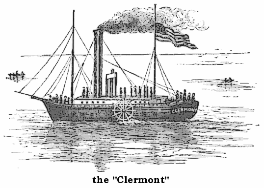
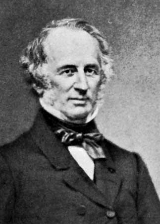
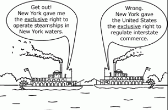
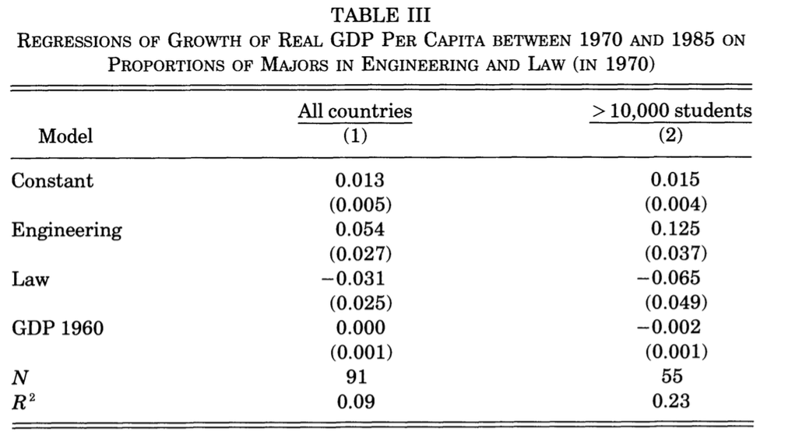
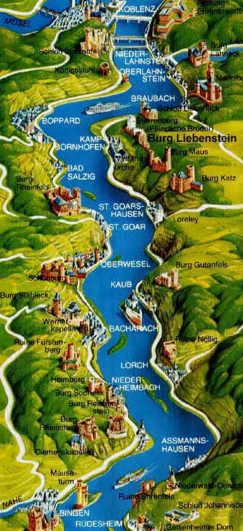

```{r setup, include=FALSE}
options(htmltools.dir.version = FALSE)
knitr::opts_chunk$set(echo=F,
                      message=F,
                      warning=F,
                      fig.retina = 3,
                      fig.align = "center")
library("tidyverse")
library("ggrepel")
library("fontawesome")
xaringanExtra::use_tile_view()
xaringanExtra::use_tachyons()
xaringanExtra::use_freezeframe()

update_geom_defaults("label", list(family = "Fira Sans Condensed"))
update_geom_defaults("text", list(family = "Fira Sans Condensed"))

set.seed(256)

theme_slides <- theme_light() + 
  theme(
    text = element_text(family = "Fira Sans", size = 24)
  )

```


class: inverse, center, middle

# Profit-Seeking

---

# Profit-Seeking

.pull-left[
.smallest[
$$\pi=\underbrace{pq}_{revenues}-\underbrace{(wl+rk)}_{costs}$$

- .hi-purple[The firm's costs are all of the factor-owner's incomes!]
    - Landowners, laborers, creditors are all paid rent, wages, and interest, respectively

- Profits are the .hi-purple[residual value] leftover after paying all factors

- Profits are income for the .hi[residual claimant(s)] of the production process (i.e. **owner(s)** of a firm):
    - Entrepreneurs
    - Shareholders
]
]

.pull-right[
.center[

]
]

---

# Who Gets the Profits?

.pull-left[
$$\pi=\underbrace{pq}_{revenues}-\underbrace{(wl+rk)}_{costs}$$

- Residual claimants have incentives to maximize firm's profits, as this *maximizes their own income*

- Entrepreneurs and shareholders are the only participants in production that are *not* guaranteed an income!
    - Starting and owning a firm is inherently **risky**!

]

.pull-right[
.center[

]
]

---

# Profits and Entrepreneurship

.pull-left[
.smallest[
- In markets, production must face the .hi[profit test]:
  - .hi-purple[Is consumer's willingness to pay > opportunity cost of inputs?]

- Profits are an indication that **value is being created for society**

- Losses are an indication that **value is being destroyed for society**

- Survival for sellers in markets *requires* firms continually create value and earn profits or die
]
]

.pull-right[

.center[

]
]

---

# Profit Seeking: the Microeconomics I

.pull-left[

```{r, fig.retina=3}
library(mosaic)
mc<-function(x){2}
demand<-function(x){10-x}
mr<-function(x){10-2*x}

CS<-tibble(x=c(0,0,8),
           y=c(10,2,2))
#PS<-tibble(x=c(0,0,2),
#           y=c(10,2,2))

#line_colors <- c("Supply" = "red", "Demand" = "blue")
#surplus_colors <-c("Consumer" = "blue", "Producer" = "red")

ggplot(data.frame(x=c(0,10)), aes(x=x))+
  geom_polygon(data=CS, aes(x=x,y=y), fill="blue",alpha=0.5)+
  stat_function(fun=demand, geom="line", size=2, color = "blue")+
    geom_label(aes(x=9,y=demand(9)), color = "blue", label="Demand", size = 5)+
  stat_function(fun=mc, geom="line", size=2, color = "red")+
    geom_label(aes(x=6,y=mc(6)), color = "red", label=expression(MC(q)==AC(q)), size = 5)+
  geom_segment(x=8, xend=8, y=0, yend=2, size=1, linetype="dotted")+
  geom_label(aes(x=3, y= 5), label="CS", color="blue", size =5)+
    scale_x_continuous(breaks=seq(0,10,1),
                     limits=c(0,10),
                     expand=expand_scale(mult=c(0,0.1)))+
  scale_y_continuous(breaks=seq(0,10,1),
                     limits=c(0,10),
                     labels=scales::dollar,                   
                     expand=expand_scale(mult=c(0,0.1)))+
  guides(fill=F)+
  labs(x = "Quantity",
       y = "Price")+
  theme_classic(base_family = "Fira Sans Condensed", base_size=20)

```

.source[Some assumptions to make the graph simple: `\\(C(q)=cq\\)`, i.e. the firm has no fixed costs, and constant marginal costs. See more information [here](https://microf21.classes.ryansafner.com/content/2.5-content/#common-cost-assumptions).]

]

.pull-right[

- Production generates **economic surplus**

- In a *competitive* market in long run equilibrium, economic profit is driven to $0.
  - $p=AC(q)_{min}$, otherwise firms would enter/exit
  - $p=MC(q)$, allocatively efficient (goods produced until $MB=MC)$
  - .blue[Consumer surplus] and .red[producer surplus] is maximized


]

---

# Profit Seeking: the Microeconomics II

.pull-left[

```{r, fig.retina=3}
CS_2<-tibble(x=c(0,0,4),
           y=c(10,6,6))
dwl<-tibble(x=c(4,4,8),
           y=c(6,2,2))
mr<-function(x){10-2*x}

#line_colors <- c("Supply" = "red", "Demand" = "blue")
#surplus_colors <-c("Consumer" = "blue", "Producer" = "red")

ggplot(data.frame(x=c(0,10)), aes(x=x))+
  
  # surpluses
  geom_polygon(data=CS_2, aes(x=x,y=y), fill="blue",alpha=0.5)+
  geom_rect(xmin=0,xmax=4,ymin=2,ymax=6,fill="green", alpha=0.25)+ #profit
  geom_polygon(data=dwl, aes(x=x,y=y), fill="black",alpha=0.5)+ #dwl
  
  # surplus labels
  geom_label(aes(x=1.5, y= 4), label="Profit", color="green", size =5)+
  geom_label(aes(x=1.5, y= 7.5), label="CS", color="blue", size =5)+
  geom_label(aes(x=5.5, y= 3.5), label="DWL", color="black", size =5)+
  
  # lines 
  stat_function(fun=demand, geom="line", size=2, color = "blue")+
    geom_label(aes(x=9,y=demand(9)), color = "blue", label="Demand", size = 5)+
  stat_function(fun=mr, geom="line", size=2, color = "purple")+
    geom_label(aes(x=4.5,y=mr(4.5)), color = "purple", label=expression(MR(q)), size = 5)+
  stat_function(fun=mc, geom="line", size=2, color = "red")+
    geom_label(aes(x=6,y=mc(6)), color = "red", label=expression(MC(q)==AC(q)), size = 5)+
  
  # optimal dots
  geom_segment(x=0, xend=4, y=6, yend=6, size=1, linetype="dotted")+
  geom_segment(x=8, xend=8, y=0, yend=2, size=1, linetype="dotted")+
  geom_segment(x=4, xend=4, y=0, yend=6, size=1, linetype="dotted")+
  
  geom_point(x=4,y=6, size=3)+
  geom_text(x=4.5,y=6.5,label=expression(paste("(",q^o,", ",p^o,")")), size=5)+
    scale_x_continuous(breaks=seq(0,10,1),
                     limits=c(0,10),
                     expand=expand_scale(mult=c(0,0.1)))+
  scale_y_continuous(breaks=seq(0,10,1),
                     limits=c(0,10),
                     labels=scales::dollar,                   
                     expand=expand_scale(mult=c(0,0.1)))+
  guides(fill=F)+
  labs(x = "Quantity",
       y = "Price")+
  theme_classic(base_family = "Fira Sans Condensed", base_size=20)

```

]

.pull-right[

- Firms with .hi[market power] will want to set $q^*: MC(q)=MR(q)$ and raise price $p^*$

- Still creates **economic surplus**
    - Generates less <span class="blue">consumer surplus</span> than before
    - Some surplus is captured as <span class="green">profit</span>
    - Some surplus is wasted as **deadweight loss**
]


---

class: inverse, center, middle

# Economic Rents

---

# Economic Rent

.pull-left[
.center[

]
]

.pull-right[

- .hi[Economic rent]: a return on a resource above its normal market return (opportunity cost)

- Has no allocative effect on resources, entirely “inframarginal”

- A windfall that resource owners get for free
]

---

# Economic Rent

.left-column[
.center[

]

.center[
Larry Bird
]
]

.right-column[

> “I love this game so much, I’d play it for a dollar.”

]

---

# Economic Rent

.pull-left[

- Recall .hi-red[market supply] is the **minimum willingness to accept**, the minimum price necessary to bring a resource to market (its opportunity cost)

- But all (equivalent) labor is paid the *market wage*, $w^*$ determined by market labor supply and labor demand

]

.pull-right[

```{r, fig.retina=3}
supply<-function(x){x}

rent<-tribble(
  ~x, ~y,
  0, 0,
  5, 5,
  0, 5
)
# make plot 

ggplot(data.frame(x=c(0,10)), aes(x=x))+
  geom_polygon(data=rent, aes(x=x,y=y, fill="red"), alpha=0.5)+ #CS
  stat_function(fun=demand, geom="line", size=2, color = "blue")+
    geom_label(aes(x=9,y=demand(9)), color = "blue", label="Demand", size = 5)+
  stat_function(fun=supply, geom="line", size=2, color = "red")+
    geom_label(aes(x=9,y=supply(9)), color = "red", label="Supply", size = 5)+
  geom_segment(x=5, xend=5, y=0, yend=5, size=1, linetype="dotted")+
  geom_segment(x=0, xend=5, y=5, yend=5, size=1, linetype="dotted")+
    scale_x_continuous(breaks=c(0,5),
                       labels=c(0,"L*"),
                     expand=expand_scale(mult=c(0,0.1)))+
  scale_y_continuous(breaks=c(0,5),
                     labels=c(0,"w*"),
                     limits=c(0,10),
                     expand=expand_scale(mult=c(0,0.1)))+
  guides(fill=F)+
  labs(title = "Labor Market",
       x = "Quantity of Labor (L)",
       y = "Price of Labor, (w)")+
  theme_classic(base_family = "Fira Sans Condensed", base_size=20)
```
]

---

# Economic Rent

.pull-left[

- Some workers would have accepted a job for less than $w^*$

- These inframarginal workers earn .hi[economic rent] in excess of what is needed to bring them into the market (their opportunity cost)

]

.pull-right[

```{r, fig.retina=3}

rent<-tribble(
  ~x, ~y,
  0, 0,
  5, 5,
  0, 5
)
# make plot 

ggplot(data.frame(x=c(0,10)), aes(x=x))+
  geom_polygon(data=rent, aes(x=x,y=y, fill="red"), alpha=0.5)+ #CS
  stat_function(fun=demand, geom="line", size=2, color = "blue")+
    geom_label(aes(x=9,y=demand(9)), color = "blue", label="Demand", size = 5)+
  stat_function(fun=supply, geom="line", size=2, color = "red")+
    geom_label(aes(x=9,y=supply(9)), color = "red", label="Supply", size = 5)+
  geom_segment(x=5, xend=5, y=0, yend=5, size=1, linetype="dotted")+
  geom_segment(x=0, xend=5, y=5, yend=5, size=1, linetype="dotted")+
    scale_x_continuous(breaks=c(0,5),
                       labels=c(0,"L*"),
                     expand=expand_scale(mult=c(0,0.1)))+
  scale_y_continuous(breaks=c(0,5),
                     labels=c(0,"w*"),
                     limits=c(0,10),
                     expand=expand_scale(mult=c(0,0.1)))+
  guides(fill=F)+
  labs(title = "Labor Market",
       x = "Quantity of Labor (L)",
       y = "Price of Labor, (w)")+
  theme_classic(base_family = "Fira Sans Condensed", base_size=20)
```
]

---

# Economic Rent

.pull-left[

- Consider a factor (such as prime real estate) for which the supply is perfectly inelastic (e.g. a fixed supply)

- Then the **entire value of the land is economic rent**!

- .hi-purple[The *less* elastic the supply of a factor, the *more* economic rent it generates!]

]

.pull-right[

```{r, fig.retina=3}
# make plot 

ggplot(data.frame(x=c(0,10)), aes(x=x))+
  geom_rect(xmin=0,xmax=5,ymin=0,ymax=5, fill="red", alpha=0.3)+ #CS
  stat_function(fun=demand, geom="line", size=2, color = "blue")+
    geom_label(aes(x=9,y=demand(9)), color = "blue", label="Demand", size = 5)+
  geom_vline(xintercept=5, size=2, color = "red")+
    geom_label(aes(x=5,y=10), color = "red", label="Supply", size = 5)+
  geom_segment(x=5, xend=5, y=0, yend=5, size=1, linetype="dotted")+
  geom_segment(x=0, xend=5, y=5, yend=5, size=1, linetype="dotted")+
    scale_x_continuous(breaks=c(0,5),
                       labels=c(0,"T*"),
                     expand=expand_scale(mult=c(0,0.1)))+
  scale_y_continuous(breaks=c(0,5),
                     labels=c(0,"r*"),
                     limits=c(0,10),
                     expand=expand_scale(mult=c(0,0.1)))+
  guides(fill=F)+
  labs(title = "Land Market",
       x = "Quantity of Prime Real Estate (T)",
       y = "Price of Prime Real Estate, (r)")+
  theme_classic(base_family = "Fira Sans Condensed", base_size=20)
```
]

---

# Economic Rent

.pull-left[
- There are some factors of production that are **fixed** in the economy:
  - Managerial talent
  - Worker talent
  - Location
  - First-mover advantage
  - Technological secrets/IP
  - License/permit access
  - Political connections
  - Lobbying
]

.pull-right[
.center[

]
]

---

# Economic Rent

.pull-left[
.center[

]
]

.pull-right[

- Owners of these factors earn .hi[economic rents]: returns higher than their opportunity cost (what is needed to bring them online, $p>AC(q)$

- Economic rents arise from **scarcity** & **relative differences** between quality of these factors

- In the short run, inframarginal firms using these scarce factors gain a cost-advantage (in short run)

]

---

# Are Profits Rents?

.pull-left[
.center[

]
]

.pull-right[

- In a competitive market, over the long run, .hi-purple[profits are dissipated through competition]
  - Rival firms willing to pay for scarce factor to gain an advantage

- The competition over these factors **pushes up their prices** (i.e. costs to firms purchasing this factor; squeezes profits to zero)

]

---

# Economic Rent: Microeconomics IV

.pull-left[
.center[

]
]

.pull-right[
.smaller[
- Firm’s perspective: .hi-purple[rents are included in the opportunity cost (price) for inputs over long run]
  - Must pay a factor enough to *keep it out of other uses*

- Factor owners (workers, landowners, inventors, etc) earn higher rents as higher payments for their services (wages, rents, interest, royalties, etc)
  - Often induces competition to supply alternative factors, which may dissipate the rents
]
]

---

# Rents and Rent-Seeking Behavior

.left-column[
.center[

]
]

.right-column[
.quitesmall[
- Alfred Marshall: in a competitive market, an “economic rent” depends on:

1. **Time-period**: 
  - Short run: inelastic factors (like capital) earn .hi-purple[quasi—rents] due to their being fixed
  - Long run: these returns normalize to market return (zero excess profits)

2. **Point of view**:
  - Firm’s point of view: these are **costs of production** that must be paid; and **price-determined**, i.e. rents must rise via competition to make dissipate profits to 0
  - Society’s point of view: some factors really are fixed, and may earn excess returns that are **price-determining**, i.e. demand for fixed factor sets a high price
]
]

---

# *Quasi*-Rents in Short Run

```{r}
tc=function(x){x^3-4*x^2+9*x+10}

demand<-function(x){10-x}
supply<-function(x){x}
demand_firm<-function(x){10}
mc_cc<-function(x){3*x^2-8*x+9}
ac_cc<-function(x){x^2-4*x+10+10/x}
avc_cc<-function(x){x^2-4*x+9}

sr_firm<-ggplot(data.frame(x=c(0,10)), aes(x=x))+
    stat_function(fun=mc_cc, geom="line", size=2, color = "red")+
  geom_label(aes(x=3.5,y=mc_cc(3.5)), color = "red", label="MC(q)", size = 5)+
    stat_function(fun=ac_cc, geom="line", size=2, color = "orange")+
  geom_label(aes(x=4.5,y=ac_cc(4.5)), color = "orange", label="AC(q)", size = 5)+
  stat_function(fun=avc_cc, geom="line", size=2, color = "brown")+
  geom_label(aes(x=3.5,y=avc_cc(3.5)), color = "brown", label="AVC(q)", size = 5)+
    scale_x_continuous(breaks=NULL,
                     limits=c(0,5),
                     expand=expand_scale(mult=c(0,0.1)))+
  scale_y_continuous(breaks=NULL,
                     limits=c(0,20),
                     expand=expand_scale(mult=c(0,0.1)))+
  guides(fill=F)+
  labs(title = "Representative Firm",
       x = "Quantity",
       y = "Price")+
  theme_classic(base_family = "Fira Sans Condensed", base_size=20)
```

.pull-left[
```{r,fig.height=4.5}
sr_firm+
  geom_rect(xmin=0,xmax=3,ymin=ac_cc(3),ymax=12,fill="green",alpha=0.5)+
  geom_hline(yintercept=12, geom="line", size=2, color = "blue")+
  geom_label(x=5.125, y=12, color = "blue", label = "Demand", size =5)+
  geom_segment(x=3, xend=3, y=0, yend=12, size=1, linetype="dotted")+
  geom_segment(x=0, xend=3, y=ac_cc(3), yend=ac_cc(3), size=1, linetype="dotted")
```

]

.pull-right[
```{r,fig.height=4.5}
industry<-ggplot(data.frame(x=c(0,10)), aes(x=x))+
  stat_function(fun=demand, geom="line", size=2, color="blue")+
  annotate(geom = "label", x = 9, y = demand(9), label = "Demand", color = "blue")+

    scale_x_continuous(breaks=NULL,
                     limits=c(0,10),
                     expand=expand_scale(mult=c(0,0.1)))+
  scale_y_continuous(breaks=NULL,
                     limits=c(0,10),
                     expand=expand_scale(mult=c(0,0.1)))+
  guides(fill=F)+
  labs(title = "Industry",
       x = "Quantity",
       y = "Price")+
  theme_classic(base_family = "Fira Sans Condensed", base_size=16)

supply_up<-function(x){x+2}

industry+stat_function(fun=supply_up, geom="line", size=2, color="darkred")+
  annotate(geom = "label", x = 7, y = supply_up(7), label = "Supply", color = "darkred")+
  geom_segment(x=0,y=6,xend=4,yend=6,size=1,linetype="dotted")+
  geom_segment(x=4,y=6,xend=4,yend=0,size=1,linetype="dotted")
```
]

.smallest[

- If firms earn profit in short-run...
]

---

# *Quasi*-Rents in Short Run

.pull-left[
```{r,fig.height=4.5}
sr_firm+
  geom_hline(yintercept=10, geom="line", size=2, color = "blue")+
  geom_label(aes(x=4.75,y=demand_firm(4.75)), color = "blue", label="Demand", size = 5)+
  geom_segment(x=2.8, xend=2.8, y=0, yend=10, size=1, linetype="dotted")
```

]

.pull-right[
```{r,fig.height=4.5}
industry+stat_function(fun=supply_up, geom="line", size=2, color="darkred")+
  annotate(geom = "label", x = 7, y = supply_up(7), label = "Supply", color = "darkred")+
  geom_segment(x=0,y=6,xend=4,yend=6,size=1,linetype="dotted")+
  geom_segment(x=4,y=6,xend=4,yend=0,size=1,linetype="dotted")+
  stat_function(fun = supply, geom = "line", size = 2, color = "red")+
  annotate(geom = "label", x = 9, y = supply(9), label = "Supply 2", color = "red")+
  geom_segment(x=0,y=5,xend=5,yend=5,size=1,linetype="dotted")+
  geom_segment(x=5,y=5,xend=5,yend=0,size=1,linetype="dotted")
```
]

.smallest[

- If firms earn profit in short-run...

- More capital will flow into firm over long run, pushing profits to 0
  - Also, more firms enter, pushing market price down
]

---

# *Quasi*-Rents in Short Run

.pull-left[
```{r,fig.height=4.5}
sr_firm+
  geom_rect(xmin=0,xmax=2.53,ymin=8,ymax=ac_cc(2.53),fill="black",alpha=0.5)+
  geom_hline(yintercept=8, geom="line", size=2, color = "blue")+
  geom_label(x=4.75, y=8, color = "blue", label = "Demand", size =5)+
  geom_segment(x=2.53, xend=2.53, y=0, yend=ac_cc(2.53), size=1, linetype="dotted")+
  geom_segment(x=0, xend=2.53, y=ac_cc(2.53), yend=ac_cc(2.53), size=1, linetype="dotted")
```

]

.pull-right[
```{r,fig.height=4.5}
supply_down<-function(x){x-2}

industry+stat_function(fun=supply_down, geom="line", size=2, color="darkred")+
  annotate(geom = "label", x = 9, y = supply_down(9), label = "Supply", color = "darkred")+
  geom_segment(x=0,y=4,xend=6,yend=4,size=1,linetype="dotted")+
  geom_segment(x=6,y=4,xend=6,yend=0,size=1,linetype="dotted")
```
]

.smallest[

- If firms earn losses in short-run...
]

---

# *Quasi*-Rents

.pull-left[
```{r,fig.height=4.5}
sr_firm+
  geom_hline(yintercept=10, geom="line", size=2, color = "blue")+
  geom_label(aes(x=4.75,y=demand_firm(4.75)), color = "blue", label="Demand", size = 5)+
  geom_segment(x=2.8, xend=2.8, y=0, yend=10, size=1, linetype="dotted")
```

]

.pull-right[
```{r,fig.height=4.5}
industry+stat_function(fun=supply_down, geom="line", size=2, color="darkred")+
  annotate(geom = "label", x = 9, y = supply_down(9), label = "Supply", color = "darkred")+
  geom_segment(x=0,y=4,xend=6,yend=4,size=1,linetype="dotted")+
  geom_segment(x=6,y=4,xend=6,yend=0,size=1,linetype="dotted")+
  stat_function(fun = supply, geom = "line", size = 2, color = "red")+
  annotate(geom = "label", x = 9, y = supply(9), label = "Supply 2", color = "red")+
  geom_segment(x=0,y=5,xend=5,yend=5,size=1,linetype="dotted")+
  geom_segment(x=5,y=5,xend=5,yend=0,size=1,linetype="dotted")
```
]

.smallest[

- If firms earn losses in short-run...

- Capital will flow out of firm over long run in pursuit of normal profits, pushing losses to 0
  - Also, firms will exit, pushing market price up
]

---

# *Quasi*-Rents

.pull-left[
.smallest[
- Competitive industry in the long run: firms earn .hi-purple[“normal economic profit”] (of 0)
  - all factors of production are paid their opportunity cost

- Return to (fixed) capital in firm = opportunity cost of holding capital in firm (versus other investment opportunities)
]
]
.pull-right[
```{r}
sr_firm+
  geom_hline(yintercept=10, geom="line", size=2, color = "blue")+
  geom_label(aes(x=4.75,y=demand_firm(4.75)), color = "blue", label="Demand", size = 5)+
  geom_segment(x=2.8, xend=2.8, y=0, yend=10, size=1, linetype="dotted")
```
]

---

# *Quasi*-Rents

.pull-left[
.quitesmall[
- But in **short run**, when some factors are fixed (i.e. capital), if price $>$ average cost:

- Firm must pay its variable factors (variable costs) or else they will leave the firm

- Revenues leftover go to fixed factors (fixed costs) i.e. capital
  - In SR, these are fixed (perfectly inelastic supply)
  - Capital earns .hi[“quasi-rents”] *because* it is fixed
  - Returns higher than its long-run equilibrium price (opportunity cost)

- But these quasi-rents will be eroded away in the long run
  - Firms bid for the scarce factors, raising its price to opportunity cost
]
]

.pull-right[
```{r,}
sr_firm+
  geom_rect(xmin=0,xmax=3,ymin=ac_cc(3),ymax=12,fill="green",alpha=0.5)+
  geom_hline(yintercept=12, geom="line", size=2, color = "blue")+
  geom_label(x=5.125, y=12, color = "blue", label = "Demand", size =5)+
  geom_segment(x=3, xend=3, y=0, yend=12, size=1, linetype="dotted")+
  geom_segment(x=0, xend=3, y=ac_cc(3), yend=ac_cc(3), size=1, linetype="dotted")
```

]

---

class: inverse, center, middle

# Rent-Seeking

---

# Rent-Seeking Behavior

.pull-left[
.center[

]
]

.pull-right[

- Economic rent is a prize, a return above normal market return (opportunity cost)

- The existence of economic rents breeds competition over the rents, which may or may not dissipate the value of the rent

- This competition for rents is .hi[rent-seeking behavior]: sinking costly resources (that you cannot get back!) into acquiring the economic rent

]


---

# Rent-Seeking Behavior in Markets

.pull-left[

```{r, fig.retina=3}
CS_2<-tibble(x=c(0,0,4),
           y=c(10,6,6))
dwl<-tibble(x=c(4,4,8),
           y=c(6,2,2))
mr<-function(x){10-2*x}

#line_colors <- c("Supply" = "red", "Demand" = "blue")
#surplus_colors <-c("Consumer" = "blue", "Producer" = "red")

ggplot(data.frame(x=c(0,10)), aes(x=x))+
  
  # surpluses
  geom_polygon(data=CS_2, aes(x=x,y=y), fill="blue",alpha=0.5)+
  geom_rect(xmin=0,xmax=4,ymin=2,ymax=6,fill="green", alpha=0.25)+ #profit
  geom_polygon(data=dwl, aes(x=x,y=y), fill="black",alpha=0.5)+ #dwl
  
  # surplus labels
  geom_label(aes(x=1.5, y= 4), label="Profit", color="green", size =5)+
  geom_label(aes(x=1.5, y= 7.5), label="CS", color="blue", size =5)+
  geom_label(aes(x=5.5, y= 3.5), label="DWL", color="black", size =5)+
  
  # lines 
  stat_function(fun=demand, geom="line", size=2, color = "blue")+
    geom_label(aes(x=9,y=demand(9)), color = "blue", label="Demand", size = 5)+
  stat_function(fun=mr, geom="line", size=2, color = "purple")+
    geom_label(aes(x=4.5,y=mr(4.5)), color = "purple", label=expression(MR(q)), size = 5)+
  stat_function(fun=mc, geom="line", size=2, color = "red")+
    geom_label(aes(x=6,y=mc(6)), color = "red", label=expression(MC(q)==AC(q)), size = 5)+
  
  # optimal dots
  geom_segment(x=0, xend=4, y=6, yend=6, size=1, linetype="dotted")+
  geom_segment(x=8, xend=8, y=0, yend=2, size=1, linetype="dotted")+
  geom_segment(x=4, xend=4, y=0, yend=6, size=1, linetype="dotted")+
  
  geom_point(x=4,y=6, size=3)+
  geom_text(x=4.5,y=6.5,label=expression(paste("(",q^o,", ",p^o,")")), size=5)+
    scale_x_continuous(breaks=seq(0,10,1),
                     limits=c(0,10),
                     expand=expand_scale(mult=c(0,0.1)))+
  scale_y_continuous(breaks=seq(0,10,1),
                     limits=c(0,10),
                     labels=scales::dollar,                   
                     expand=expand_scale(mult=c(0,0.1)))+
  guides(fill=F)+
  labs(x = "Quantity",
       y = "Price",
       caption = expression(paste("Demand: ", p(q)==10-q, ", Cost: ", C(q)==2*q)))+
  theme_classic(base_family = "Fira Sans Condensed", base_size=20)

```

]

.pull-right[

.smallest[
- The .green[monopoly profits] earned with market power are an .hi[economic rent]
  - This is the "prize" of market power

- The whole point of market competition is that .hi-purple[free entry will dissipate these economic rents]; firm’s profits will fall to normal (zero)

]
]

---

# Rent-Seeking Behavior in Politics

.pull-left[
.center[

]
]

.pull-right[

- The key to success in politics is to promise to give away money for free

- The problem is .hi-purple[you cannot give away money for free even if you tried!]

- The promise of earning a rent breeds **competition over the rents** (.hi[rent-seeking])

]

---

# Government Intervention Creates Rents I

.pull-left[
.center[

]
]

.pull-right[

.smallest[
- Political authorities intervene in markets in various ways that benefit some groups at the expense of everyone else
  - subsidies to groups (often producers)
  - regulation of industries
  - tariffs, quotas, and special exemptions
  - tax breaks and loopholes
  - conferring monopoly and other privileges

- These interventions create .hi[economic rents] for their beneficiaries by reducing competition

- This is a transfer of wealth from consumers/taxpayers to politically-favored groups

]
]
---

# Rent-Seeking I 

.left-column[
.center[


Anne Kreuger

1934-
]
]

.right-column[

.quitesmall[
> "In many market-oriented economies, government restrictions upon economic activity are pervasive facts of life. These restrictions give rise to rents of a variety of forms, and people often compete for the rents. Sometimes, such competition is perfectly legal. In other instances, rent seeking takes other forms, such as bribery, corruption, smuggling, and black markets."

> ".hi[When quantitative restrictions are imposed upon and effectively constrain imports, an import license is a valuable commodity]...It has always been recognized that there are some costs associated with licensing: paperwork, the time spent by entrepreneurs in obtaining their licenses, the cost of the administrative apparatus necessary to issue licenses, and so on. Here, the argument is carried one step further: .hi[in many circumstances resources are devoted to competing for those licenses]," (p.848). 

]

.source[Kreuger, Anne, (1974), "The Political Economy of the Rent-Seeking Society," *American Economic Review* 84(4): 833-850]

]

---

# Rent-Seeking: The Ugly of Monopoly

.pull-left[

```{r, fig.retina=3}
CS_2<-tibble(x=c(0,0,4),
           y=c(10,6,6))
dwl<-tibble(x=c(4,4,8),
           y=c(6,2,2))
mr<-function(x){10-2*x}

#line_colors <- c("Supply" = "red", "Demand" = "blue")
#surplus_colors <-c("Consumer" = "blue", "Producer" = "red")

ggplot(data.frame(x=c(0,10)), aes(x=x))+
  
  # surpluses
  geom_polygon(data=CS_2, aes(x=x,y=y), fill="blue",alpha=0.5)+
  geom_rect(xmin=0,xmax=4,ymin=2,ymax=6,fill="black", alpha=0.25)+ #profit
  geom_polygon(data=dwl, aes(x=x,y=y), fill="black",alpha=0.5)+ #dwl
  
  # surplus labels
  geom_label(aes(x=1.5, y= 4), label="Rent-Seeking", color="black", size =5)+
  geom_label(aes(x=1.5, y= 7.5), label="CS", color="blue", size =5)+
  geom_label(aes(x=5.5, y= 3.5), label="DWL", color="black", size =5)+
  
  # lines 
  stat_function(fun=demand, geom="line", size=2, color = "blue")+
    geom_label(aes(x=9,y=demand(9)), color = "blue", label="Demand", size = 5)+
  stat_function(fun=mr, geom="line", size=2, color = "purple")+
    geom_label(aes(x=4.5,y=mr(4.5)), color = "purple", label=expression(MR(q)), size = 5)+
  stat_function(fun=mc, geom="line", size=2, color = "red")+
    geom_label(aes(x=6,y=mc(6)), color = "red", label=expression(MC(q)==AC(q)), size = 5)+
  
  # optimal dots
  geom_segment(x=0, xend=4, y=6, yend=6, size=1, linetype="dotted")+
  geom_segment(x=8, xend=8, y=0, yend=2, size=1, linetype="dotted")+
  geom_segment(x=4, xend=4, y=0, yend=6, size=1, linetype="dotted")+
  
  geom_point(x=4,y=6, size=3)+
  geom_text(x=4.5,y=6.5,label=expression(paste("(",q^o,", ",p^o,")")), size=5)+
    scale_x_continuous(breaks=seq(0,10,1),
                     limits=c(0,10),
                     expand=expand_scale(mult=c(0,0.1)))+
  scale_y_continuous(breaks=seq(0,10,1),
                     limits=c(0,10),
                     labels=scales::dollar,                   
                     expand=expand_scale(mult=c(0,0.1)))+
  guides(fill=F)+
  labs(x = "Quantity",
       y = "Price",
       caption = expression(paste("Demand: ", p(q)==10-q, ", Cost: ", C(q)==2*q)))+
  theme_classic(base_family = "Fira Sans Condensed", base_size=20)
```

]

.pull-right[

.smallest[
- The .green[monopoly profits] earned with market power are an .hi[economic rent]
  - This is the "prize" of market power

- What if the market power is earned through political lobbying for an anti-competitive regulation?

- Firm(s) willing to invest resources into the "competitive market" of creating and maintaining economic rents

- **Total loss to society** $= \text{DWL}+\text{Rent-seeking (of all competitors!)}$
]
]

---

# Rent-Seeking III

.left-column[
.center[


Gordon Tullock

1922-2014
]
]

.right-column[

> "The rectangle to the left of the [Deadweight loss] triangle is the income transfer that a successful monopolist can extort from the customers. .hi[Surely we should expect that with a prize of this size dangling before our eyes, potential monopolists would be willing to invest large resources in the activity of monopolizing. In fact the investment that could be profitably made in forming a monopoly would be larger than this rectangle, since it represents merely the income transfer]," (p.231). 


.source[Tullock, Gordon, (1967), "The Welfare Cost of Tariffs, Monopolies, and Theft," *Western Economic Journal* 5(3): 224-232.]

]
---

# Rent-Seeking IV

.left-column[
.center[


Gordon Tullock

1922-2014
]
]

.right-column[

.smaller[
> "Entrepreneurs should be willing to invest resources in attempts to form a monopoly until the marginal cost equals the properly discounted return. The potential customers would also be interested in preventing the transfer and should be willing to make large investments to that end. Once the monopoly is formed, continual efforts to either break the monopoly or muscle into it would be predictable. Here again considerable resources might be invested. The holders of the monopoly, on the other hand, would be willing to put quite sizable sums into the defense of their power to receive these transfers," (p.231).

]

.source[Tullock, Gordon, (1967), "The Welfare Cost of Tariffs, Monopolies, and Theft," *Western Economic Journal* 5(3): 224-232.]

]

---


# Again: Institutions Channel Self-Interest

.pull-left[

```{r, fig.align = "center", fig.retina = 3}
plot_eqs <- tibble(x = c(1,3),
                 y = c(1,1),
                 lab = c("Good Equilibrium", "Bad Equilibrium"))

plot_opt <- tibble(x = c(2),
                 y = c(3),
                 lab = c("Self Interest"))


plot_shock <- tibble(x = c(2),
                 y = c(1),
                 lab = c("Institutions"))

ggplot(plot_eqs, aes(x = x,
                   y = y))+
  geom_point(data = plot_eqs, shape = 22, size = 45, fill = "limegreen")+ # shape for equilibria
  geom_point(data = plot_shock, shape = 24, size = 26, fill = "firebrick2")+ # shape for shock
  geom_text(data = plot_eqs, mapping = aes(label = lab), color = "white")+ # text for equilibria
  geom_text(data = plot_shock, mapping = aes(label = lab), color = "white")+ # text for shock
  
  # self interest
  geom_point(data = plot_opt, shape = 21, size = 28, fill = "lightblue")+ # shape for self
  geom_text(data = plot_opt, mapping = aes(label = lab), color = "white")+ # text for self
  
  scale_x_continuous(expand = c(0.125,0.125))+
  scale_y_continuous(limits = c(0, 4), expand = c(0,0))+
  
  # arrow from self to eqs
  annotate("segment", x = 2, xend = 2, y = 2.5, yend = 1.5, colour = "#000000", size=0.5, linetype = 2, alpha=1, arrow=arrow(length=unit(0.25,"cm"), ends="last", type="closed"))+

    annotate("segment", x = 1.25, xend = 1.75, y = 1, yend = 1, colour = "#000000", size=0.5, linetype = 2, alpha=1, arrow=arrow(length=unit(0.25,"cm"), ends="first", type="closed"))+
  annotate("segment", x = 2.25, xend = 2.75, y = 1, yend = 1, colour = "#000000", size=0.5, linetype = 2, alpha=1, arrow=arrow(length=unit(0.25,"cm"), ends="last", type="closed"))+
  theme_void(base_family = "Fira Sans Condensed", base_size=20)
```
]

.pull-right[

> "[Though] .hi-blue[he intends only his own gain], and he is in this, as in many other cases, .hi-red[led by an invisible hand] to promote an end which was no part of his intention…By pursuing his own interest he frequently .hi-green[promotes that of the society] more effectually than when he really intends to promote it," (Book IV, Chapter 2.9).
]

.source[Smith, Adam, 1776, [*An Enquiry into the Nature and Causes of the Wealth of Nations*](https://www.econlib.org/library/Smith/smWN.html)]

---

# Profit Seeking vs. Rent Seeking: Some Generalizations

| Profit-Seeking | Rent-Seeking |
|----------------|--------------|
| "market entrepreneurs" | "political entrepreneurs" |
| hire engineers | hire lawyers |
| use own/investor funds | use taxpayer funds |
| sell to consumers | sell to the State |
| face the profit test | *don't* face the profit test |
| earn profits or losses | earn rents |
| create surplus for consumers | creates artificial protection from competition |
| hopes to capture some of that surplus | captures rents from that artificial protection |

---

# An American Story of Rent-Seeking vs. Profit-Seeking

.pull-left[
.center[

]
]

.pull-right[
.center[


Robert Fulton
]

]

.source[Fulson, Burton, (2010), *The Myth of the Robber Barons: A New Look at the Rise of Big Business in America*, 6th ed.]

---

# An American Story of Rent-Seeking vs. Profit-Seeking

.pull-left[
.center[


Edward Gibbons
]
]

.pull-right[
.center[


Cornelius Vanderbilt
]

]

.source[Fulson, Burton, (2010), *The Myth of the Robber Barons: A New Look at the Rise of Big Business in America*, 6th ed.]

---

# An American Story of Rent-Seeking vs. Profit-Seeking
 
.center[

]

---

# Gibbons v. Ogden (1824)

.left-column[
.center[


John Marshall

1755-1835
]
]

.right-column[

.quitesmall[
> "A right over [licenses and patents] has never been pretended to in any instance except as incidental to the exercise of some other unquestionable power.
The present is an instance of the assertion of that kind, as incidental to a municipal power; that of superintending the internal concerns of a State, and particularly of extending protection and patronage, in the shape of a monopoly, to genius and enterprise. 
The grant to Livingston and Fulton interferes with the freedom of intercourse, and on this principle, its constitutionality is contested.(p. 22 US 229)

> "If there was any one object riding over every other in the adoption of the Constitution, it was to keep the commercial intercourse among the States free from all invidious and partial restraints," (p. 22 US 231)

]

.source[Gibbons v. Ogden, 22 U.S. 1 (1824) [Justia Case Law](https://supreme.justia.com/cases/federal/us/22/1/#tab-opinion-1923815)]

]

---

# The Allocation of Talent Matters I

> "A country's most talented people typically organize production by others, so they can spread their ability advantage over a larger scale. When they start firms, they innovate and foster growth, but when they become rent seekers, they only redistribute wealth and reduce growth. Occupational choice depends on returns to ability and to scale in each sector, on market size, and on compensation contracts. In most countries, rent seeking rewards talent more than entrepreneurship does, leading to stagnation. Our evidence shows that countries with a higher proportion of engineering college majors grows faster; wheras countries with a higher proportion of law concentrators grow more slowly," (p. 503)

.source[Murphy, Kevin M, Andrei Shleifer, and Robert M. Vishny, (1991). "The Allocation of Talent: Implications for Growth," *Quarterly Journal of Economics* 106(2): 503-530]


---

# The Allocation of Talent Matters II

.center[

]

.source[Murphy, Kevin M, Andrei Shleifer, and Robert M. Vishny, (1991). "The Allocation of Talent: Implications for Growth," *Quarterly Journal of Economics* 106(2): 503-530]

---

class: inverse, center, middle

# Private Rent-Seeking?

---

# Private Rent-Seeking I

.center[
<iframe width="980" height="550" src="https://www.youtube.com/embed/D7GlM_Wb_iE" title="YouTube video player" frameborder="0" allow="accelerometer; autoplay; clipboard-write; encrypted-media; gyroscope; picture-in-picture" allowfullscreen></iframe>

*The Rievers* (1969) based on William Faulkner’s (1962) book
]

---

# Private Rent-Seeking II

.center[

 

]

---

# Private Rent-Seeking III 

.center[
<iframe width="980" height="550" src="https://www.youtube.com/embed/NanVFWoNtTA" frameborder="0" allow="accelerometer; autoplay; encrypted-media; gyroscope; picture-in-picture" allowfullscreen></iframe>
]

---

# The Fundamental Transformation

.left-column[
.center[


.smallest[
Olvier Williamson

1932-

Economics Nobel 2009
]
]
]
.right-column[

- A contract between two parties constitutes a .hi["fundamental transformation"] from *ex ante* competitive market to an *ex post* bilateral monopoly
  - Two parties depend on one another's performance to jointly capture the gains from exchange
  - Committing a factor of production into such a relationship is a .hi-purple[specific investment], possibly .hi-purple[sunk cost]

- Creates the possibility of .hi-purple[post-contractual opportunism] by the parties

]

---

# The Fundamental Transformation

.pull-left[
.center[

]
]

.pull-right[

- This .purple[bilateral dependency] creates .hi-purple[“quasi rents”] from cooperation that might be **appropriated** by a party 

- Need to contract *ex ante* to protect *ex post* possibility of someone threatening to appropriate the rents

- Inability to prevent this may cause parties to inefficiently avoid making agreements!  

]

---

# Appropriable Quasi-Rents

.left-column[
.center[


.smallest[
Benjamin Klein

1943-
]
]
]

.right-column[

.smallest[
> "Coase's fundamental insight [was] that transaction, coordination, and contracting costs must be considered explicitly in explaining the extent of vertical integration...[We] explore one particular cost of using the market system-the possibility of postcontractual opportunistic behavior," (p.297)

> "The particular circumstance we emphasize as likely to produce a serious threat of this type of reneging on contracts is the presence of appropriable specialized quasi rents. After a specific investment is made and such quasi rents are created, the possibility of opportunistic behavior is very real. Following Coase's framework, this problem can be solved in two possible ways: vertical integration or contracts," (p.298)

]
.source[Klein, Benjamin, Robert G Crawford, and Armen A Alchian, 1978, "Vertical Integration, Appropriable Rents, and the Competitive Contracting Process," *Journal of Law and Economics* 21(2): 297-326]
]

---

# Appropriable Quasi-Rents

.left-column[
.center[


.smallest[
Benjamin Klein

1943-
]
]
]

.right-column[

.smallest[
> "An appropriable quasi rent is not a monopoly rent in the usual sense, that is, the increased value of an asset protected from market entry over the value it would have in an open market. [It] can occur with no market closure or restrictions placed on rival assets. Once installed, an asset may be so expensive to remove or so specialized to a particular user that if the price paid to the owner was somehow reduced the asset's services to that user would not be reduced," (p.299).

]
.source[Klein, Benjamin, Robert G Crawford, and Armen A Alchian, 1978, "Vertical Integration, Appropriable Rents, and the Competitive Contracting Process," *Journal of Law and Economics* 21(2): 297-326]

]

---

# Appropriable Quasi-Rents

.left-column[
.center[


.smallest[
Benjamin Klein

1943-
]
]
]

.right-column[

.smaller[
> "Because of transaction and mobility costs, 'market power' will exist in many situations not commonly called monopolies. There may be many potential suppliers of a particular asset to a particular user but once the investment in the asset is made, the asset may be so specialized to a particular user that monopoly or monopsony power, or both, is created," (p.299).

]

.source[Klein, Benjamin, Robert G Crawford, and Armen A Alchian, 1978, "Vertical Integration, Appropriable Rents, and the Competitive Contracting Process," *Journal of Law and Economics* 21(2): 297-326]

]

---

# Asset Specificity

.left-column[
.center[

]
]

.right-column[

- .hi["Asset specificity"]: degree to which an asset has alternative valuable uses outside a particular use
  - Or degree to which it loses value for other uses

- .hi-purple[General assets] can easily be diverted to other productive uses for most or all of their value
  - Very liquid: easily re-sold on thick markets for most of its value
  - e.g. trucks, shipping containers, hammers, computers

]

---

# Asset Specificity

.left-column[
.center[

]
]

.right-column[

- .hi-purple[Specific assets] have few alternative uses outside a specific use
  - Illiquid: would sell for drastically lower than its value
  - e.g. dyes, drill presses, designed to make a very specific output
]

---

# Asset Specificity

.left-column[
.center[


.smallest[
Olvier E Williamson

1932-

Economics Nobel 2009
]
]
]
.right-column[

.quitesmall[

> "Four types of asset specificity are usefully distinguished: 

> [1.] site specificity - e.g. successive stations that are located in a cheek-by-jowl relation to each other so as to economize on inventory and transportation expenses; 

> [2.] physical asset specificity - e.g. specialized dies that are required to produce a component;

> [3.] human asset specificity that arises in a learning-by-doing fashion; and

> [4.] dedicated assets, which represent a discrete investment in generalized...production capacity that would not be made but for the prospect of selling a significant amount of product to a specific consumer," (p. 95).

]
]
.source[Williamson, Oliver E, 1985, *The Economic Institutions of Capitalism*]

---

# Asset Specificity: Example

.pull-left[
.center[


]
]

.pull-right[
- Suppose one party owns a **generic** asset - trucks
  - High opportunity cost - easily resold or put to other uses
  
- Another party owns a **highly specific** asset - highly specialized machines
  - Next best alternative use is a boat anchor
]

---

# Asset Specificity: Example

.pull-left[
.center[

]
]

.pull-right[

- Suppose a contract between them creates **$50,000** of joint net value for the owner of the generic asset and the owner of the specific asset

- Can't recontract until next year

- Once the contract is signed, the owner of the generic asset threatens to pull out of the contract
  - **Demands $49,000** of the "quasirents of cooperation"

]

---

# They Are Altering The Deal...

.center[

<iframe width="980" height="550" src="https://www.youtube.com/embed/qd8hy032uLc" frameborder="0" allow="accelerometer; autoplay; encrypted-media; gyroscope; picture-in-picture" allowfullscreen></iframe>

]

---

# ...Pray They Don't Alter it Any Futher

.center[
<iframe width="980" height="550" src="https://www.youtube.com/embed/OXyH1XkQo44" frameborder="0" allow="accelerometer; autoplay; encrypted-media; gyroscope; picture-in-picture" allowfullscreen></iframe>
]

---

# Asset Specificity: Example

.pull-left[
.center[

]
]

.pull-right[

- Foreseeing such contractual hazards parties will be reluctant to cooperate

- Or will choose a less specialized and less efficient technology

]

---

# Vertical Integration

.pull-left[
.center[

]
]

.pull-right[

- One solution to this problem is .hi[vertical integration]: the firm internalizes a stage of production in the supply chain
  - Often by .hi-purple[buying its supplier]

- Avoids hold up problems and post-contractual opportunism
]

---

# Vertical Integration

.pull-left[
.center[

]
]

.pull-right[

- **Antitrust implications**: vertical integration *may* not be done to intentionally create market power, but to economize on transaction costs from asset specificity
]

---

# Vertical Integration

.left-column[
.center[


.smallest[
Benjamin Klein

1943-
]
]
]

.right-column[

.smaller[
> "[A]s assets become more specific and more appropriable quasi rents are created (and therefore the gains from opportunistic behavior increases), the costs of contracting will generally increase more than the costs of vertical integration. Hence, *ceterus paribus*, we are more likely to observe vertical integration," (p.298).

]
.source[Klein, Benjamin, Robert G Crawford, and Armen A Alchian, 1978, "Vertical Integration, Appropriable Rents, and the Competitive Contracting Process," *Journal of Law and Economics* 21(2): 297-326]

]


---

# Vertical Integration

.left-column[
.center[


.smallest[
Benjamin Klein

1943-
]
]
]

.right-column[

> "We maintain that if an asset has a substantial portion of quasi rent which is strongly dependent upon some other particular asset, both assets will tend to be owned by one party," (p.300).

.source[Klein, Benjamin, Robert G Crawford, and Armen A Alchian, 1978, "Vertical Integration, Appropriable Rents, and the Competitive Contracting Process," *Journal of Law and Economics* 21(2): 297-326]

]

---

# Vertical Integration

.left-column[
.center[


.smallest[
Benjamin Klein

1943-
]
]
]

.right-column[
.smallest[
> "The primary alternative to vertical integration as a solution to the general problem of opportunistic behavior is some form of economically enforceable long-term contract," (p. 302).

]
.source[Klein, Benjamin, Robert G Crawford, and Armen A Alchian, 1978, "Vertical Integration, Appropriable Rents, and the Competitive Contracting Process," *Journal of Law and Economics* 21(2): 297-326]

]

---

# Vertical Integration

.left-column[
.center[


.smallest[
Benjamin Klein

1943-
]
]
]

.right-column[
.smallest[
> "Long-term contracts used as alternatives to vertical integration can be assumed to take two forms: (1) an explicitly stated contractual guarantee legally enforced by the government or some other outside institution, or (2) an implicit contractual guarantee enforced by the market mechanism of withdrawing future business if opportunistic behavior occurs...[However, they are] often very costly solutions. They entail costs of specifying possible contingencies and the policing and litigation costs of detecting violations and enforcing the contract in the courts..every contingency cannot be cheaply specified in a contract or even known and because legal redress is expensive..." (p.303)

]
.source[Klein, Benjamin, Robert G Crawford, and Armen A Alchian, 1978, "Vertical Integration, Appropriable Rents, and the Competitive Contracting Process," *Journal of Law and Economics* 21(2): 297-326]

]

---

# GM and Fisher Body Example

.pull-left[
.center[

]
]

.pull-right[
.center[

]
]

---

# GM and Fisher Body Example

.left-column[
.center[


.smallest[
Benjamin Klein

1943-
]
]
]

.right-column[
.smallest[
"The manufacture of dies for stamping parts in accordance with the above specifications [for a Mustang or Ford model] gives a value to these dies specialized to Ford, which implies an appropriable quasi rent in those dies...once the large sunk fixed cost of the specific investment in the dies is made, the incentive for Ford to opportunistically renegotiate a lower price at which it will accept body parts from the independent die owner may be large. Similarly, if there is a large cost to Ford from the production delay of obtaining an alternative supplier of the specific body parts, the independent die owner may be able to capture quasi rents by demanding a revised higher price for the parts. Since the opportunity to lose the specialized quasi rent of assets is a debilitating prospect, neither party would invest in such equipment. Joint ownership of designs and dies removes this incentive to attempt appropriation," (p.308).

]
.source[Klein, Benjamin, Robert G Crawford, and Armen A Alchian, 1978, "Vertical Integration, Appropriable Rents, and the Competitive Contracting Process," *Journal of Law and Economics* 21(2): 297-326]

]

---

# GM and Fisher Body Example

.left-column[
.center[


.smallest[
Benjamin Klein

1943-
]
]
]

.right-column[
.smallest[
> "[I]n 1919 General Motors entered a ten-year contractual agreement with Fisher Body for the supply of closed auto bodies. In order to encourage Fisher Body to make the required specific investment, this contract had an exclusive dealing clause whereby General Motors agreed to buy substantially all its closed bodies from Fisher. This exclusive dealing arrangement significantly reduced the possibility of General Motors acting opportunistically by demanding a lower price for the bodies after Fisher made the specific investment in production capacity,"


]
.source[Klein, Benjamin, Robert G Crawford, and Armen A Alchian, 1978, "Vertical Integration, Appropriable Rents, and the Competitive Contracting Process," *Journal of Law and Economics* 21(2): 297-326]

]

---

# GM and Fisher Body Example

.left-column[
.center[


.smallest[
Benjamin Klein

1943-
]
]
]

.right-column[
.smallest[
> "But large opportunities were created by this exclusive dealing clause for Fisher to take advantage of General Motors, namely to demand a monopoly price for the bodies. Therefore, the contract attempted to fix the price which Fisher could charge for the bodies supplied to General Motors...The price was set on a cost plus 17.6 per cent basis [and had other provisions to protect GM]." 

]
.source[Klein, Benjamin, Robert G Crawford, and Armen A Alchian, 1978, "Vertical Integration, Appropriable Rents, and the Competitive Contracting Process," *Journal of Law and Economics* 21(2): 297-326]

]

---

# GM and Fisher Body Example

.left-column[
.center[


.smallest[
Benjamin Klein

1943-
]
]
]

.right-column[

.smallest[
> "Unfortunately, however, these complex contractual pricing provisions did not work out in practice. The demand conditions facing General Motors and Fisher Body changed dramatically over the next few years. There was a large increase in the demand for automobiles and a significant shift away from open bodies to the closed body styles supplied by Fisher. Meanwhile, General Motors was very unhappy with the price it was being charged by its now very important supplier, Fisher...By 1924, General Motors had found the Fisher contractual relationship intolerable and began negotiations for purchase of the remaining stock in Fisher Body, culminating in a final merger agreement in 1926," (pp.309-310). 

]

.source[Klein, Benjamin, Robert G Crawford, and Armen A Alchian, 1978, "Vertical Integration, Appropriable Rents, and the Competitive Contracting Process," *Journal of Law and Economics* 21(2): 297-326]

]

