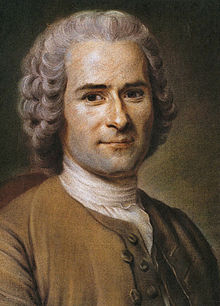

```{r setup, include=FALSE}
options(htmltools.dir.version = FALSE)
knitr::opts_chunk$set(echo=F,
                      message=F,
                      warning=F,
                      fig.retina = 3,
                      fig.align = "center")
library("tidyverse")
library("ggrepel")
library("fontawesome")
xaringanExtra::use_tile_view()
xaringanExtra::use_tachyons()
xaringanExtra::use_freezeframe()

update_geom_defaults("label", list(family = "Fira Sans Condensed"))
update_geom_defaults("text", list(family = "Fira Sans Condensed"))

set.seed(256)

theme_slides <- theme_light() + 
  theme(
    text = element_text(family = "Fira Sans", size = 24)
  )

```


class: inverse, center, middle

# Efficiency

---

# A Puzzle 

.left-column[
.center[


.smallest[
Jean-Jacques Rousseau

1712-1778
]
]
]

.right-column[

> “There is but one law which, from its nature, needs unanimous consent. This is the social compact; for civil association is the most voluntary of all acts”

]

---

hobbes

wicksell

rent-seeking private, appropriable rents