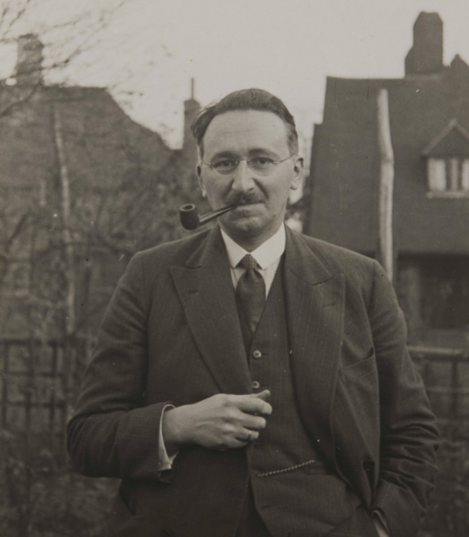

```{r setup, include=FALSE}
options(htmltools.dir.version = FALSE)
knitr::opts_chunk$set(echo=F,
                      message=F,
                      warning=F,
                      fig.retina = 3,
                      fig.align = "center")
library("tidyverse")
library("ggrepel")
library("fontawesome")
xaringanExtra::use_tile_view()
xaringanExtra::use_tachyons()
xaringanExtra::use_freezeframe()

update_geom_defaults("label", list(family = "Fira Sans Condensed"))
update_geom_defaults("text", list(family = "Fira Sans Condensed"))

set.seed(256)

```

# Major Players in a Liberal Democracy

.pull-left[
.smaller[
- .hi[Voters] express preferences through elections

- .hi[Special interest groups] provide additional information and advocacy for lawmaking

- .hi[Politicians] create laws reflecting voter and interest group preferences

- .hi[Bureaucrats] implement laws according to goals set by politicians

- .hi[Judges] interpret laws to settle individual disputes
]
]
.pull-right[
.center[

]
]

---

# *Judges* in a Liberal Democracy

.pull-left[

- .hi[Judges] interpret laws/regulations to settle individual disputes that arise under existing law

- Some judges are elected by voters, some are appointed 
]

.pull-right[
.center[


]
]

---

# The *Judicial System* in a Liberal Democracy

.pull-left[

- Importance of the .hi[rule of law] for protecting rights and good governance

- Judges & judiciary meant to be .hi-purple[independent of politics] (legislative & executive powers)

]

.pull-right[
.center[


]
]

---


# Sources of Law in the United States


.pull-left[
.quitesmall[
1. .hi[Constitution of the United States]
  - “the rules of the game”
  - framework for government

2. .hi[Legislation]
  - Congress, State & local legislatures
  - “the will of the people”
  - majoritarian and political

3. .hi[Regulation (“Administrative Law”)]
  - regulatory agencies
  - executive orders

4. .hi[Common law & judiciary]
  - “case law”
  - judge-made law
]
]
.pull-right[
.center[

]
]

---

# Powers of Judicial Branch

.left-column[
.center[

]
]

.right-column[
> “The judicial Power of the United States, shall be vested in one supreme Court, and in such inferior Courts as the Congress may from time to time ordain and establish.” (Article III, $\S1)$
]

---

# Judicial Review

.pull-left[
.center[

]
]

.pull-right[

- Marbury v. Madison (1803)

- Chief Justice John Marshall establishes the precedent of .hi[judicial review]: Supreme Court can strike down laws of Congress that it determines violates the Constitution
  - later implied to cover Executive actions too

]

---

# Judicial Review

.left-column[
.center[


John Marshall

1755-1835
]
]

.right-column[
.smallest[
> “.hi[It is emphatically the province and duty of the Judicial Department to say what the law is.]”

> “If then, the courts are to regard the constitution, and .hi[the constitution is superior to any ordinary act of the legislature], [then] the constitution, and not such ordinary act, must govern the case to which they both apply.”

> “Thus, .hi[the particular phraseology of the Constitution of the United States confirms] and strengthens the principle, supposed to be essential to all written Constitutions, .hi[that a law repugnant to the Constitution is void], and that .hi[courts, as well as other departments, are bound by [the Constitution]]”

]

.source[Marbury v. Madison]
]

---

# The Constitution Preserves Common Law 

.left-column[
.center[

]
]

.right-column[
.tiny[
> “No person shall be held to answer for a capital, or otherwise infamous crime, unless on a presentment or indictment of a Grand Jury, except in cases arising in the land or naval forces, or in the Militia, when in actual service in time of War or public danger; nor shall any person be subject for the same offence to be twice put in jeopardy of life or limb; nor shall be compelled in any criminal case to be a witness against himself, nor be deprived of life, liberty, or property, without due process of law; nor shall private property be taken for public use, without just compensation.” (Amendment V)

> “In all criminal prosecutions, the accused shall enjoy the right to a speedy and public trial, by an impartial jury of the State and district wherein the crime shall have been committed, which district shall have been previously ascertained by law, and to be informed of the nature and cause of the accusation; to be confronted with the witnesses against him; to have compulsory process for obtaining witnesses in his favor, and to have the Assistance of Counsel for his defence.” (Amendment VI)

> “In Suits at common law, where the value in controversy shall exceed twenty dollars, the right of trial by jury shall be preserved, and no fact tried by a jury, shall be otherwise re-examined in any Court of the United States, than according to the rules of the common law.” (Amendment VII)
]

]

---

# The Civil Law vs. Criminal Law Distinction

.pull-left[

- Major areas of law can be split into:

- .hi[Public law] vs. .hi[Private law]
  - laws about relationship between individuals and State
  - laws about relationship between individuals

- .hi[Criminal] vs. .hi[Civil law]

]

.pull-right[
.center[

]
]

---

# Criminal Law

.pull-left[

- State proscribes behaviors deemed to be harmful to property, health, safety, or morals

- Established by statute (legislation)

- Punishes and/or rehabilitates criminal with fines, imprisonment, or execution

- *Highest* burden of proof against Plaintiff (State): .hi-turquoise[“beyond a reasonable doubt”]
]

.pull-right[
.center[

]
]

---

# Civil Law

.pull-left[

- Property, contracts, torts, family, business associations, etc

- Statutes, regulations, and case law

- Burden of proof lower: .hi-turquoise[“preponderance of the evidence”] (i.e. 50.1%)

]

.pull-right[
.center[

]
]

---

# Civil vs. Criminal Law

.pull-left[

- The same dispute can have both a criminal *and* a civil lawsuit

- O.J. Simpson
  - *The People of the State of California v. Simpson*: acquitted of 1st degree murder (criminal)
  - *Rufo v. Simpson*: lost civil case, Plaintiffs awarded $33.5 million in damages for wrongful death and battery
]

.pull-right[
.center[

]
]

---

# Common Law System

.pull-left[
.smaller[
- Primarily .hi[case law] that arise out of individual disputes and .hi-purple[precedent]
  - statutes by legislatures can supersede, but play a smaller role

- Strongly determined by historical customs, practices, and expectations of the community
  - .hi-turquoise[“judge-made law”]

- First arose in England, all former British colonies (including U.S.) follow common law tradition
]
]

.pull-right[
.center[

]
]

---

# Common Law System: Features

.pull-left[
.smaller[
- .hi[Adversarial]: “law” arises out of disputes between two private parties
  - Parties have legal counsel, each run the trial in their clients’ interests
  - Role of judge is neutral referee, lawyers follow rules of evidence & procedure

- Jury trials in most (not necessarily all) cases
  - Jury determines questions of fact; judge determines questions of law
]
]
.pull-right[
.center[

]
]

---

# Common Law System: Features

.pull-left[
.smallest[
- Judges help settle *specific* disputes by interpreting law, relying heavily on .hi[precedent] (decisions of previous judges in cases with similar facts)
  - judges “discover” the law as it already exists
  - extract common applicable principles out of a variety of individual cases (.hi-purple[“case law”])
  - in that sense, **judges do not “_make_ law”** like a legislature does
  
- Common law rooted in common practices, evolves over time with new cases and decisions

- .hi-purple[Statutes] enacted by legislatures can change law
]
]

.pull-right[
.center[

]
]

---

# Common Law System: Features

.left-column[
.center[


.smallest[
Oliver Wendell Holmes, Jr.

1841—1935

Associate Justice of U.S. Supreme Court
]]
]

.right-column[

.quitesmall[

> “The life of the law has not been logic: it has been experience. The felt necessities of the time, the prevalent moral and political theories, intuitions of public policy, avowed or unconscious, even the prejudices which judges share with their fellow-men, have had a good deal more to do than the syllogism in determining the rules by which men should be governed. The law emodies the story of a nation's development through many centuries, and it cannot be dealt with as if it contained only the axioms and corollaries of a book of mathematics. In order to know what it is, we must know what it has been, and what it tends to become...The substance of the law at any given time pretty nearly corresponds, so far as it goes, with what is then understood to be convenient; but its form and machinery, and the degree to which it is able to work out desired results, depend very much upon its past.”

]

.source[Holmes, Oliver Wendell, Jr., 1881, [*The Common Law*](https://www.gutenberg.org/files/2449/2449-h/2449-h.htm), Lecture I]

]

---

# Common Law System: Features

.left-column[
.center[


.smallest[
Benjamin N. Cardozo

1870—1938

Associate Justice of U.S. Supreme Court
]]
]

.right-column[

> “Common law does not work from pre-established truths of universal and inflexible validity to conclusions derived from them deductively...Its method is inductive, and it draws its generalizations from particulars” (p.22-23).

.source[ Benjamin N. Cardozo, 1921, *The Nature of the Judicial Process*]
]

---

# Common Law System: Features

.pull-left[
- If you go to (a good) law school in the U.S., you *are not taught* “the law” (“here it is”)

- You read a ton of cases, and are made to *think* about what the law is, by extracting common principles from those cases

- You only learn “the law” of the State you will be barred in when you are studying for the Bar exam!
]

.pull-right[
.center[

]
]

---


# Common Law System: Law is Expectations & Customs

.left-column[
.center[


.smallest[
F.A. Hayek

1899—1992

Economics Nobel 1974]
]
]

.right-column[

.quitesmall[
> “*Rule* in this context means simply a propensity or disposition to act or not to act in a certain manner, which will manifest itself in what we call a *practice*  or custom,” (p. 75)

> “While the process of articulation of pre-existing rules will thus often lead to alterations in the body of such rules, this will have little effect on the belief that .hi[those formulating the rules do no more, and have no power to do more, than to find and express already existing rules], a task in which fallible humans will often go wrong, but in the performance of which they have no free choice. .hi[The task will be regarded as one of discovering something which exists, not as one of creating something new],” (p.78)

> “The group may have persisted only because its members have developed and transmitted ways of doing things which made the group as a whole more effective than others; but the reason why certain things are done in certain ways no member of the group needs to know,” (p.80).

]

.source[Hayek, F.A., 1973, "The Changing Concept of Law," Ch. 10 in *Law, Legislation, and Liberty, Vol. 1: Rules and Order*]

]

---

# Common Law System: Separation of Powers

.left-column[
.center[


.smallest[
F.A. Hayek

1899—1992

Economics Nobel 1974]
]
]

.right-column[

.quitesmall[
> “.hi[The freedom of the British] which in the eighteenth century the rest of Europe came so much to admire was thus not...originally a product of the separation of powers between legislature and executive, but rather .hi[a result of the fact that the law that governed the decisions of the courts was the common law], a law existing independently of anyone's will and at the same time binding upon and developed by the independent courts; .hi[a law with which parliament only rarely interfered] and, when it did, mainly only to clear up doubtful points within a given body of law. One might even say that a sort of .hi[separation of powers had grown up in England, not because the 'legislature' alone made law, but because it did *not*]: because the law was determined by courts independent of the power which organized and directed government, the power namely of what was misleadingly called the 'legislature',” (p.85).

]
.source[Hayek, F.A., 1973, "The Changing Concept of Law," Ch. 10 in *Law, Legislation, and Liberty, Vol. 1: Rules and Order*]
]

---
# Common Law System: Role of the Judge

.left-column[
.center[


.smallest[
F.A. Hayek

1899—1992

Economics Nobel 1974]
]
]

.right-column[

.smallest[
> “.hi[The chief concern of a common law judge must be the expectations which the parties in a transaction would have reasonably formed] on the basis of the general practices that the ongoing order of actions rests on. In deciding what expectations were reasonable in this sense he can take account only of such practices (customs or rules) as in fact could determine the expectations of the parties and such facts as may be presumed to have been known to them. And these parties would have been able to form common expectations, in a situation which in some respects must have been unique, only because they interpreted the situation in terms of what was thought to be appropriate conduct and which need not have been known to them in the form of an articulated rule,” (p.86)

]

.source[Hayek, F.A., 1973, "The Changing Concept of Law," Ch. 10 in *Law, Legislation, and Liberty, Vol. 1: Rules and Order*]

]
---

# Common Law System: Role of the Judge

.left-column[
.center[


.smallest[
F.A. Hayek

1899—1992

Economics Nobel 1974]
]
]

.right-column[

.smallest[
> “By the time the judge is called upon to decide a case, the parties in the dispute will already have acted in the pursuit of their own ends and mostly in particular circumstances unknown to any authority; and the expectations which have guided their actions and in which one of them has been disappointed will have been based on what they regarded as established practices. The task of the judge will be to tell them what ought to have guided their expectations, not because anyone had told them before that this was the rule, but because this was the established custom which they ought to have known. The question for the judge here can never be whether the action in fact taken was expedient from some higher point of view, or served a particular result desired by authority, but only whether the conduct under dispute conformed to recognized rules,” (p.86)

]

.source[Hayek, F.A., 1973, "The Changing Concept of Law," Ch. 10 in *Law, Legislation, and Liberty, Vol. 1: Rules and Order*]
]

---

# Courts in the U.S.

.center[

]

---

# Courts in the U.S.: States

.pull-left[

- Most disputes start in State trial courts

- Can be appealed to State appellate courts (if applicable), ultimately the State Supreme court
  - Supreme court has discretion over what cases it will hear

- Note each State determines its own court system
]

.pull-right[
.center[


.smallest[
Frederick County Courthouse
]
]
]

---

class: inverse, center, middle

# Modeling Judge Behavior

---

# *Judges* in a Liberal Democracy

.pull-left[
.smallest[
- Judges are independent actors with their own objectives, just like other economic/political actors

- The judge’s problem:

1. **Choose:** .hi-purple[ < a ruling >]

2. **In order to maximize:** .hi-green[< ??? >]

3. **Subject to:** .hi-red[< precedent, legislative intent, etc. >]

- What *would we wish* judges maximize? 
  - Justice? Truth? Efficiency?

- What do judges *actually* maximize?
]
]

.pull-right[
.center[


]
]

---

# (Some) Judges’ Electoral Incentives

- In many U.S. States, state judges **campaign for office** and are **elected**

.quitesmall[
> “.hi[Politicians are not neutral maximizers of the public good; they respond to incentives, just like other individuals.] A clear understanding of political behavior requires, therefore, an understanding of incentive structures. .hi[Yet with few exceptions this insight has not been applied to those politicians. we call judges.] The lack of attention is surprising, since .hi[judicial incentive structures differ widely in the United States] and thus provide an ideal testing ground for economic theories of politics. One important division occurs across the states. .hi[State court judges are elected in 23 states and are appointed in 27.] Of the 23 elected states, ten use highly competitive partisan elections, whereas in the remainder judges run on nonpartisan ballots. A second division occurs between federal and state judges. .hi[Federal judges are appointed and have life tenure, whereas, as just noted, many state court judges are elected and], with the exception of superior court judges in Rhode Island, .hi[none have life tenure.] .hi[We argue that in cases involving corporate defendants with out-of-state headquarters, elected judges, particularly partisan elected judges, have an incentive to grant larger awards than other judges.]” (pp.341-342)

]

.source[Helland, Eric and Alexander Tabarrok, 2011, “The Effect of Electoral Institutions on Tort Awards,” *American Law and Economics Review* 4(2): 341-370]

---

# (Some) Judges’ Electoral Incentives

.center[
<iframe width="980" height="550" src="https://www.youtube.com/embed/poL7l-Uk3I8" title="YouTube video player" frameborder="0" allow="accelerometer; autoplay; clipboard-write; encrypted-media; gyroscope; picture-in-picture" allowfullscreen></iframe>

]

---

# (Some) Judges’ Electoral Incentives

.quitesmall[
> “Partisan elected judges must cater to their constituents, and they must raise campaign funds in order to be elected. We hypothesized that these forces would .hi[increase awards in partisan elected states relative to other states, particularly awards against out-of-state businesses. The evidence], both from the cross-state regressions and from diversity of citizenship cases, .hi[strongly supports the partisan election hypothesis. In cases involving out-of-state defendants and in-state plaintiffs, the average award (conditional on winning) is $362,988 higher in partisan than in nonpartisan states; $230,092 of the larger award is due to a bias against out-of-state defendants, and the remainder is due to generally higher awards against businesses in partisan states.]

]

.source[Helland, Eric and Alexander Tabarrok, 2011, “The Effect of Electoral Institutions on Tort Awards,” *American Law and Economics Review* 4(2): 341-370]

---

# (Some) Judges’ Electoral Incentives

.quitesmall[
> “[In Kansas], fourteen judicial districts employ partisan competitive elections to select judges, while seventeen employ gubernatorial appointment and non-competitive retention elections. The retention districts provide an appropriate baseline of comparison: Although judges in those districts must face the voters, *by law, there can be no challengers.* Comparing officials in a single state permits us to hold constant numerous potential confounding factors, most importantly the legal environment in which those officials operate,” (p. 2).

> “.hi[Competitive elections, and the attendant risk of a viable challenger, force incumbent politicians to pay more heed to potential negative voter reactions to their behavior.] With respect to this paper’s specific object of empirical scrutiny, .hi[the risk of challenger entry induces trial judges elected in partisan competitive districts in Kansas to behave more punitively than their peers in that state’s retention districts],” (p.20).

]

.source[Gordon, Sanford Clark and Gregory Huber, 2007, “The Effect of Electoral Competitiveness on Incumbent Behavior,” *Quarterly Journal of Political Science* 2(2): 107-138]

---

# (Some) Judges’ Electoral Incentives

> “We also examine the impact of elections on judicial behavior by testing for the presence of political sentencing cycles [in criminal cases in Washington Superior Courts, where judges are elected every 4 years in nonpartisan elections]. .hi[We find that sentencing of serious offenses becomes more severe as elections approach: sentence lengths increase by around 10% between the beginning and the end of a judge’s political cycle],” (p.742).

.source[Berdejó, Carlos and Noam Yuchtman, 2013, *Review of Economics and Statistics* 95(3): 741-756]

---

# Ideology?

> “This paper analyzes the .hi[connection between ideology and voting of judges] using a large sample of court of appeals cases decided since 1925 and Supreme Court cases decided since 1937...We have a number of interesting results, including how .hi[a judge‘s voting‘s [sic] is affected by the voting of the other judges he serves with.] We find a .hi[political-polarization effect among Justices appointed by Democratic but not by Republican Presidents]; that is, .hi[the fewer the judges appointed by Democratic Presidents, the more liberally they vote.] With regard to court of appeals judges, we find .hi[a conformity effect: if the number of judges appointed by Republican Presidents increases (decreases) relative to the number appointed by Democratic Presidents, all judges in the circuit tend to vote more conservatively (more liberally).]”

.source[Landes, William M and Richard A Posner, 2009, “Rational Judicial Behavior: A Statistical Study,” *Journal of Legal Analysis* 1(2): 775-831]

---

# What Do Judges Maximize?

.left-column[
.center[


.smallest[
Richard A. Posner

1939—

Fmr. U.S. 7<sup>th</sup> Circuit Judge
]
]
]

.right-column[
.quitesmall[

> “At the heart of economic analysis of law is a mystery that is also an embarrassment: how to explain judicial behavior in economic terms, when almost the whole thrust of the rules governing the compensation and other terms and conditions of judicial employment is to divorce judicial action from incentives...” (p.1).

> “Analogizing judges to nonprofit enterprises, to voters in political elections, and to spectators at theatrical performances, I propose a simple model in which judicial utility is a function mainly of income, leisure, and judicial voting. I use this model to explain various judicial behaviors (ranging from stare decisis to what I call “go-along voting”), to make falsifiable predictions concerning judicial effort, and to provide a framework for evaluating changes in judicial compensation and rules of conduct and for comparing judicial with legislative behavior,” (p.1).

]

.source[Posner, Richard A, 1993, “What Do Judges Maximize? (The Same Thing Everyone Else Does),” *John M Olin Law & Economics Working Paper* 15]
]

---


# What Do Judges Maximize?

.left-column[
.center[


.smallest[
Richard A. Posner

1939—

Fmr. U.S. 7<sup>th</sup> Circuit Judge
]
]
]

.right-column[
.quitesmall[

> “Consider the following judicial utility function, in which effort is proxied by time:

$$U=U(t_j, t_l, I, R, O)$$

> $t_j$ is the number of hours per day that the judge devotes to judging, $t_l$ is the time he devotes to leisure (here defined as all activities other than judging, so that $t_j + t_l = 24)$, $I$ is pecuniary income, initially limited to judicial salary, $R$ is reputation, and $O$ are the other sources of utility for a judge discussed in this paper—popularity, prestige, and avoiding reversal,” (p.21).

]

.source[Posner, Richard A, 1993, “What Do Judges Maximize? (The Same Thing Everyone Else Does),” *John M Olin Law & Economics Working Paper* 15]
]

---

# An Interest-Group Perspective of the Judiciary

.left-column[
.center[


.smallest[
Richard A. Posner

1939—

Fmr. U.S. 7<sup>th</sup> Circuit Judge
]
]
]

.right-column[
.smallest[
> “The existence of an independent judiciary seems inconsistent with—in fact, profoundly threatening to—a political system in which public policy emerges from the struggle of interest groups to redistribute the wealth of the society in their favor, the view of the political process that underlies much of the recent economic work...on the political system. The outcomes of the struggle can readily be nullified by unsympathetic judges—and why should judges be sympathetic to a process that simply ratifies political power rather than expresses principle?” (p.876).

]

.source[Landes, William M and Richard A Posner, 1975, “The Independent Judiciary in an Interest-Group Perspective,” *Journal of Law and Economics* 18(3): 875-901]
]

---


# An Interest-Group Perspective of the Judiciary

.left-column[
.center[


.smallest[
Richard A. Posner

1939—

Fmr. U.S. 7<sup>th</sup> Circuit Judge
]
]
]

.right-column[
.smallest[
> “In the economists’ version of the interest-group theory of government, legislation is supplied to groups or coalitions that outbid rival seekers of favorable legislation. The pricce that the winning group bids is determined both by the value of legislative protection to the group’s members and the group’s ability to overcome the free-rider problems that plague coalitions. Payment takes the form of campaign contributions, votes, implicit promises of future favors, and sometimes outright bribes. In short, legislation is ‘sold’ by the legislature and ‘bought’ by the beneficiaries of the legisaltion.” (p.877)

]

.source[Landes, William M and Richard A Posner, 1975, “The Independent Judiciary in an Interest-Group Perspective,” *Journal of Law and Economics* 18(3): 875-901]
]

---


# An Interest-Group Perspective of the Judiciary

.left-column[
.center[


.smallest[
Richard A. Posner

1939—

Fmr. U.S. 7<sup>th</sup> Circuit Judge
]
]
]

.right-column[
.smallest[
> “Private sales, and other private contracts, carry legal sanctions for nonperformance...But there are no legal sanctions for the failure of a legislature to carry oout its ‘bargain...’ There is no legal mechanism analogous to a binding long-term contract by which the enacting Congress can prevent a subsequent Congress fromo amending the legislation in a way unfavorable to [special interests], or indeed fromo repealing it altogether.” (p.877)

]

.source[Landes, William M and Richard A Posner, 1975, “The Independent Judiciary in an Interest-Group Perspective,” *Journal of Law and Economics* 18(3): 875-901]
]

---

# An Interest-Group Perspective of the Judiciary

.left-column[
.center[


.smallest[
Richard A. Posner

1939—

Fmr. U.S. 7<sup>th</sup> Circuit Judge
]
]
]

.right-column[
.smallest[
> “Legislation is not self-enforcing, however. If the people subject to a law refuse to obey it, recourse to the courts i snecessary to enforce the law. A judiciary that was subservient to the current membership of the legislature could nullify legislation enacted in a previous session of the legislature. Suppose that Congress in uyear one ‘sells’ the dairy industry a heavy tax on margarine, but the next year the producers of margarine offer Congress generous inducements ot remove the tax. Congress is unlikely to respond to this demand by enacting repealing legislation...but if the judges are the perfect agents of the current Congress, they will refuse to enforce the margarine tax, the effect will be the same as legislative repeal.”

]

.source[Landes, William M and Richard A Posner, 1975, “The Independent Judiciary in an Interest-Group Perspective,” *Journal of Law and Economics* 18(3): 875-901]
]

---

# An Interest-Group Perspective of the Judiciary

.pull-left[

```{r, fig.retina=3}
demand=function(x){10-x}
cs=tribble(
  ~x, ~y,
  0, 10,
  0, 4,
  6, 4
)
d<-ggplot(data.frame(x=c(0,10)), aes(x=x))+
  geom_polygon(data = cs, aes(x=x,y=y), fill = "blue", alpha=0.5)+
  stat_function(fun=demand, geom="line", size=2, color = "blue")+
  geom_label(aes(x=2,y=demand(2)), color = "blue", label="Demand 1", size = 6)+
  geom_hline(yintercept = 4, size = 2, color = "red")+
  geom_label(x = 2, y = 4, color = "red", label = "Supply", size = 6)+
  geom_segment(x = 6, xend = 6, y = 0, yend = 4, size = 1, linetype = "dotted")+
  scale_x_continuous(breaks=c(6),
                     labels=c(expression(q[1])),
                     limits=c(0,10),
                     expand=expand_scale(mult=c(0,0.1)))+
  scale_y_continuous(breaks=c(4),
                     limits=c(0,20),
                     labels=c(expression(p[1])),
                     expand=expand_scale(mult=c(0,0.1)))+
  coord_cartesian(clip="off")+
  labs(x = "Quantity of Legislation",
       y = "Price of Legislation")+
  theme_classic(base_family = "Fira Sans Condensed", base_size=16)
d
```
]


.pull-right[

- Consider the .blue[Demand] and .red[Supply] of “selling” legislation to special interests

- Consider a Congress that can only provide special interest legislation for one period
]

---

# An Interest-Group Perspective of the Judiciary

.pull-left[

```{r, fig.retina=3}
demand2=function(x){20-2*x}
cs2=tribble(
  ~x, ~y,
  0, 20,
  0, 4,
  8, 4
)
d<-ggplot(data.frame(x=c(0,10)), aes(x=x))+
  geom_polygon(data = cs2, aes(x=x,y=y), fill = "blue", alpha=0.5)+
  stat_function(fun=demand, geom="line", size=2, color = "blue", alpha = 0.5)+
  geom_label(aes(x=2,y=demand(2)), color = "blue", label="Demand 1", size = 6)+
  
  stat_function(fun=demand2, geom="line", size=2, color = "blue")+
  geom_label(aes(x=2,y=demand2(2)), color = "blue", label="Demand 2", size = 6)+

  geom_hline(yintercept = 4, size = 2, color = "red")+
  geom_label(x = 2, y = 4, color = "red", label = "Supply", size = 6)+
  geom_segment(x = 6, xend = 6, y = 0, yend = 4, size = 1, linetype = "dotted")+
  geom_segment(x = 8, xend = 8, y = 0, yend = 4, size = 1, linetype = "dotted")+
  scale_x_continuous(breaks=c(6,8),
                     labels=c(expression(q[1], q[2])),
                     limits=c(0,10),
                     expand=expand_scale(mult=c(0,0.1)))+
  scale_y_continuous(breaks=c(4),
                     limits=c(0,20),
                     labels=c(expression(p[1])),
                     expand=expand_scale(mult=c(0,0.1)))+
  coord_cartesian(clip="off")+
  labs(x = "Quantity of Legislation",
       y = "Price of Legislation")+
  theme_classic(base_family = "Fira Sans Condensed", base_size=16)
d
```
]


.pull-right[

- Consider now if Congress could enforce this legislation permanently (and never repeal)

- Much more special interest legislation gets passed (more profitable)

- “Thus, the legislature has powerful incentives to devise methods of increasing the permanency of legislation.”
]

---

# An Interest-Group Perspective of the Judiciary

.pull-left[

```{r, fig.retina=3}
demand2=function(x){20-2*x}
cs2=tribble(
  ~x, ~y,
  0, 20,
  0, 4,
  8, 4
)
d<-ggplot(data.frame(x=c(0,10)), aes(x=x))+
  geom_polygon(data = cs2, aes(x=x,y=y), fill = "blue", alpha=0.5)+
  stat_function(fun=demand, geom="line", size=2, color = "blue", alpha = 0.5)+
  geom_label(aes(x=2,y=demand(2)), color = "blue", label="Demand 1", size = 6)+
  
  stat_function(fun=demand2, geom="line", size=2, color = "blue")+
  geom_label(aes(x=2,y=demand2(2)), color = "blue", label="Demand 2", size = 6)+

  geom_hline(yintercept = 4, size = 2, color = "red")+
  geom_label(x = 2, y = 4, color = "red", label = "Supply", size = 6)+
  geom_segment(x = 6, xend = 6, y = 0, yend = 4, size = 1, linetype = "dotted")+
  geom_segment(x = 8, xend = 8, y = 0, yend = 4, size = 1, linetype = "dotted")+
  scale_x_continuous(breaks=c(6,8),
                     labels=c(expression(q[1], q[2])),
                     limits=c(0,10),
                     expand=expand_scale(mult=c(0,0.1)))+
  scale_y_continuous(breaks=c(4),
                     limits=c(0,20),
                     labels=c(expression(p[1])),
                     expand=expand_scale(mult=c(0,0.1)))+
  coord_cartesian(clip="off")+
  labs(x = "Quantity of Legislation",
       y = "Price of Legislation")+
  theme_classic(base_family = "Fira Sans Condensed", base_size=16)
d
```
]


.pull-right[

.quitesmall[
- “If, however, the judges served at the pleasure of the legislatures, their decisions would presumably be in perfect harmony with the current legislature’s wishes, and we would be hack to the single-period model [Demand 1]” (882).

- “If the judiciary is independent, it can be expected...to enforce existing statutes in accordance with the intent of the enacting legislature...an independent judiciary thus turns out to be an ingenious device for promoting the sale of long-term special interest legislation [Demand 2], independence is not without its costs. The judiciary may decide not to enforce the deal worked out by the legislature. It may declare the law unconstitutional or interpret it in a manner that reduces the gains from the law to the group intended to benefit from it, since most sitting judges, having been appointed in an earlier period, will ‘owe’ nothing to the enacting legislature.” (883)
]

]

---

# An Interest-Group Perspective of the Judiciary

.pull-left[

```{r, fig.retina=3}
demand3=function(x){15-1.5*x}
cs3=tribble(
  ~x, ~y,
  0, 15,
  0, 4,
  7.25, 4
)
d<-ggplot(data.frame(x=c(0,10)), aes(x=x))+
  geom_polygon(data = cs3, aes(x=x,y=y), fill = "blue", alpha=0.5)+
  stat_function(fun=demand, geom="line", size=2, color = "blue", alpha = 0.5)+
  geom_label(aes(x=2,y=demand(2)), color = "blue", label="Demand 1", size = 6)+
  
  stat_function(fun=demand2, geom="line", size=2, color = "blue", alpha = 0.5)+
  geom_label(aes(x=2,y=demand2(2)), color = "blue", label="Demand 2", size = 6)+

    stat_function(fun=demand3, geom="line", size=2, color = "blue")+
  geom_label(aes(x=2,y=demand3(2)), color = "blue", label="Demand 3", size = 6)+

  geom_hline(yintercept = 4, size = 2, color = "red")+
  geom_label(x = 2, y = 4, color = "red", label = "Supply", size = 6)+
  geom_segment(x = 6, xend = 6, y = 0, yend = 4, size = 1, linetype = "dotted")+
  geom_segment(x = 8, xend = 8, y = 0, yend = 4, size = 1, linetype = "dotted")+
  geom_segment(x = 7.25, xend = 7.25, y = 0, yend = 4, size = 1, linetype = "dotted")+
  scale_x_continuous(breaks=c(6,7.25,8),
                     labels=c(expression(q[1], q[3], q[2])),
                     limits=c(0,10),
                     expand=expand_scale(mult=c(0,0.1)))+
  scale_y_continuous(breaks=c(4),
                     limits=c(0,20),
                     labels=c(expression(p[1])),
                     expand=expand_scale(mult=c(0,0.1)))+
  coord_cartesian(clip="off")+
  labs(x = "Quantity of Legislation",
       y = "Price of Legislation")+
  theme_classic(base_family = "Fira Sans Condensed", base_size=16)
d
```
]


.pull-right[

.smaller[
- “The cost of independence is shown...by the demand curve [Demand 3], which is lower than [Demand 2]. The difference between the two curves is due to the positive probability in each future period that the returns from the special-interest legislation will not be forthcoming because of adverse judicial rulings. These expectations will be incorporated into the maximum price that groups are willing to pay for favorable legislation.” (883)
]
]
