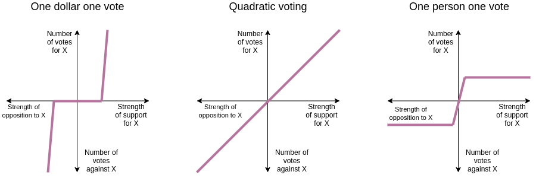

```{r setup, include=FALSE}
options(htmltools.dir.version = FALSE)
knitr::opts_chunk$set(echo=F,
                      message=F,
                      warning=F,
                      fig.retina = 3,
                      fig.align = "center")
library("tidyverse")
library("ggrepel")
library("fontawesome")
xaringanExtra::use_tile_view()
xaringanExtra::use_tachyons()
xaringanExtra::use_freezeframe()

update_geom_defaults("label", list(family = "Fira Sans Condensed"))
update_geom_defaults("text", list(family = "Fira Sans Condensed"))

set.seed(256)

```


# The Story So Far

.pull-left[

- .hi-purple[Pure democracy] (majority rule) is .hi-purple[indeterminate]
  - .hi[Condorcet's Paradox]: cycling from 3+ choices, 3+ voters, and disagreement
  - .hi[Arrow's Impossibility Theorem]: no non-dictatorial rule can efficiently and fairly determine a group choice
  - .hi-purple[Agenda control] & .hi-purple[strategic voting]

]
.pull-right[
.center[

]
]

---

# The Story So Far

.pull-left[

- Democracy devolves into .hi[dictatorship] or institutions are created to .hi-purple[restrict choice]
  - .hi[Constitutional republics]: limit domain of what may be voted on
  - Real world electoral systems reduce effective choices to 2
    - First-Past-The-Post: **Duverger's Law** $\implies$ two political parties
    - Parliamentary: "government" vs. "opposition"

]
.pull-right[
.center[

]
]

---

# The Story So Far

.pull-left[

- Voters imperfectly vote for a candidate closest to their preferences

- Voters have poor incentives $(MC>MB)$ to inform themselves or to vote for the *best* candidate
  - Good governance is a public good with .hi-purple[free rider problem]
  - .hi[Rational ignorance]
  - .hi[Rational irrationality]

]

.pull-right[
.center[

]
]

---

# Radical Markets

.pull-left[
.pull-left[
.center[


Eric Posner
]
]

.pull-right[
.center[


Glen Weyl
]
]

]

.pull-right[
.smaller[
2018, *Radical Markets: Uprooting Capitalism and Democracy for a Just Society*

- A series of proposals to make markets and democracy more free and efficient, but also more equal and just
  - too much inequality and market power right now

- Argued economically, often market-like proposals
  - mechanism design, game theory
]
]

---

# What's Wrong With 1P1V?

.pull-left[

- The bedrock of democracy is the idea of .hi[One person, one vote (1p1v)]
  - Everyone has equal voice in the outcome

- Used to argue for extending the franchise to women, African Americans, etc

- Constitution requires representation in Congress apportioned to population

]

.pull-right[
.center[

]
]

---

# What's Wrong With 1P1V?

.pull-left[

- .hi-purple[Tyranny of the majority]: unprotected minorities can get trampled on by the majority

- Persistent minorities view system as illegitimate, turn to other means of resistance
  - secession, riots, violence

]

.pull-right[
.center[

]
]

---

# What's Wrong With 1P1V?

.pull-left[

- U.S. only started protecting a lot of abused minorities in 20<sup>th</sup> century

- Mostly result of federal court cases
  - Not very democratic! Unelected, unaccountable life-long judges
  - Seem to rely on preferences of judges

]

.pull-right[
.center[

.smallest[Federal troops protecting the “Little Rock Nine” during racial integration of schools]
]
]

---

# What's Wrong With 1P1V: Ordinality

.pull-left[
- Voting systems give equal weight to preferences by person

- No way to differentiate **preferences** or **intensities**
  - Only .hi-purple[ordinal rankings]: $A > B$ or $A < B$

- An indifferent, lethargic majority, can outvote a passionate minority
]

.pull-right[
.center[

]
]

---

# Cardinality: In Markets

.pull-left[

- In markets, not only more choices, but can indulge **intensity** of your preferences

- If you *want* 4 more cookies, you can buy 4 more cookies

- Goods flow to those that value them the most, willing to pay the most
]

.pull-right[
.center[

]
]

---

# From Markets to Politics

.pull-left[

- But we can't easily transfer market mechanisms to collective choices

- .hi-purple[Free rider problem] of voting and informing oneself

- Voters with the strongest preferences can just try to "buy" the most votes

]

.pull-right[
.center[

]
]

---

# From Markets to Politics

.pull-left[

- Olson: .hi-purple[smaller, more passionate groups can better organize than large, apathetic groups]
  - most people don't know (or care) about bank regulation, nuclear power, emissions standards
  - rational ignorance

- Special interest groups have a strong incentive to capture the democratic process
  - rational: high level of participation
]

.pull-right[
.center[

]
]

---

# Getting the Price Right

.pull-left[

- In markets, the .hi-purple[cost of acquiring more goods is proportional to how much you want them]
  - Again, for 4 more cookies, pay 4x the price of one
  
]

.pull-right[
.center[

]
]
---

# Getting the Price Right

.left-column[
.center[

.smallest[
William Vickrey

1914-1996

Economics Nobel 1996
]

]
]

.right-column[

- Work on .hi-purple[auctions] and .hi-purple[auction theory]

- Auction's goal: get item to the person who values it the most

]

---

# Getting the Price Right

.left-column[
.center[

.smallest[
William Vickrey

1914-1996

Economics Nobel 1996
]

]
]

.right-column[

- Turns out, more important to get the .hi-purple[winner to pay the price that compensates for the cost that they create]
  - Other bidder cannot get the item

- .hi[Vickrey] or .hi[Second-price auction]: Winner pays the bid of the second-highest bidder

- Markets, in general: prices reflect opportunity cost of next best alternative use
  - What somebody else is willing to pay for a different use
]

---

# Getting the "Voting Price" Right: Intuition

```{r}
library("mosaic")
demand_1=function(x){10-x}
supply_1=function(x){x}

changes<-ggplot(data.frame(x=c(0,10)), aes(x=x))+
  stat_function(fun=demand_1, geom="line", size=2, color = "blue")+
    geom_label(aes(x=9,y=demand_1(9)), color = "blue", label="MSB", size = 8)+
  stat_function(fun=supply_1, geom="line", size=2, color = "#e64173")+
    geom_label(aes(x=9,y=supply_1(9)), color = "#e64173", label="MSC", size = 8)+
  geom_segment(x=0, xend=5, y=5, yend=5, size=1, linetype="dotted")+
  geom_segment(x=5, xend=5, y=0, yend=5, size=1, linetype="dotted")+
    scale_x_continuous(breaks=seq(0,10,1),
                     limits=c(0,10),
                     expand=expand_scale(mult=c(0,0.1)))+
  scale_y_continuous(breaks=seq(0,10,1),
                     limits=c(0,10),
                     expand=expand_scale(mult=c(0,0.1)),
                     labels = function(x){paste("$", x, sep="")})+
  labs(x = "Quantity of Ranch Land",
       y = "Price per Acre (Thousands)")+
  theme_classic(base_family = "Fira Sans Condensed")
```

.pull-left[

```{r, fig.retina=3}

changes
```

]

.pull-right[

- Suppose society votes to zone land for cattle ranching, optimum at A
]

---

# Getting the "Voting Price" Right: Intuition

.pull-left[

```{r, fig.retina=3}
supply_up=function(x){x+2}

dwl_neg<-tribble(
  ~x, ~y,
  5, 5,
  4, 6,
  4, 4
)

changes+
  geom_polygon(data = dwl_neg,
               aes(x = x,
                   y = y),
               fill = "black",
               alpha = 0.7)+
  stat_function(fun=supply_up, geom="line", size=2, color = "red")+
    geom_label(aes(x=6,y=supply_up(6)), color = "red", label="MSC+Frank", size = 8)+
  geom_segment(x=0, xend=4, y=6, yend=6, size=1, linetype="dotted")+
  geom_segment(x=4, xend=4, y=0, yend=6, size=1, linetype="dotted")+
  geom_point(aes(x = c(5,4),
                 y = c(5,6)),
             size = 4)+
  geom_text(x=5,y=5.5, label="A", size=8)+
  geom_text(x=4,y=6.5, label="B", size=8)+
  
    geom_segment(x=0, xend=4, y=4, yend=4, size=1, linetype="dotted")
```

]

.pull-right[

- Suppose society votes to zone land for cattle ranching, optimum at A

- But more ranching imposes a cost on Farmer Frank (Cows eat his crops)

- Without Frank, optimal ranching is at A.

- But with him, .hi-red[social cost] increases, moving social optimum back to B.

]

---

# Getting the "Voting Price" Right: Intuition

.pull-left[

```{r, fig.retina=3}
supply_up=function(x){x+2}

dwl_neg<-tribble(
  ~x, ~y,
  5, 5,
  4, 6,
  4, 4
)

changes+
  geom_polygon(data = dwl_neg,
               aes(x = x,
                   y = y),
               fill = "black",
               alpha = 0.7)+
  stat_function(fun=supply_up, geom="line", size=2, color = "red")+
    geom_label(aes(x=6,y=supply_up(6)), color = "red", label="MSC+Frank", size = 8)+
  geom_segment(x=0, xend=4, y=6, yend=6, size=1, linetype="dotted")+
  geom_segment(x=4, xend=4, y=0, yend=6, size=1, linetype="dotted")+
  geom_point(aes(x = c(5,4),
                 y = c(5,6)),
             size = 4)+
  geom_text(x=5,y=5.5, label="A", size=8)+
  geom_text(x=4,y=6.5, label="B", size=8)+
  
    geom_segment(x=0, xend=4, y=4, yend=4, size=1, linetype="dotted")
```

]

.pull-right[

- In some sense, Frank imposes an externality on society for reducing its ranching from A to B

- Frank should have to "pay" for the additional external cost imposed, which is the area of the **DWL triangle**

]

---

# Getting the "Voting Price" Right: Intuition

.pull-left[

```{r, fig.retina=3}
supply_up2=function(x){x+4}

dwl_neg2<-tribble(
  ~x, ~y,
  5, 5,
  3, 7,
  3, 3
)

changes+
  geom_polygon(data = dwl_neg2,
               aes(x = x,
                   y = y),
               fill = "black",
               alpha = 0.7)+
  stat_function(fun=supply_up2, geom="line", size=2, color = "#fb6107")+
    geom_label(aes(x=5,y=supply_up2(5)), color = "#fb6107", label="MSC+Frank'", size = 8)+
  geom_segment(x=0, xend=3, y=7, yend=7, size=1, linetype="dotted")+
  geom_segment(x=3, xend=3, y=0, yend=7, size=1, linetype="dotted")+
  geom_point(aes(x = c(5,3),
                 y = c(5,7)),
             size = 4)+
  geom_text(x=5,y=5.5, label="A", size=8)+
  geom_text(x=3,y=7.5, label="C", size=8)+
  
    geom_segment(x=0, xend=3, y=3, yend=3, size=1, linetype="dotted")
```

]

.pull-right[

- What if the cost to Frank is actually larger?

- .hi-purple[Area of DWL triangle grows in size with the *square* of the reduction in quantity]

- More valuable land (.hi-blue[higher MSB]) is prevented from becoming farmland
  - Value of lost farmland is *increasing* as more farmland is being lost!
]

---

# From Prices to Votes

.pull-left[
.center[

]
]

.pull-right[
.smaller[
- But this ruling is going to be determined by **votes**, not market prices or transactions

- Under 1p1v, marginal cost of “buying” votes is constant

- Those that **care very much** try to buy all the votes
  - Cost per vote to them is too low

- Those that **don’t care** very much
  - Cost per vote to them is too high
]
]

---

# From Prices to Votes

.pull-left[
.center[

]
]

.pull-right[

- Posner & Weyl's proposal: .hi[“Quadratic Voting”]

1.  What if people could "buy" votes to spend on an issue

2. The total cost of buying votes should increase **quadratically**
    - i.e. cost of $n$ votes is $n^2$; or 
    - most votes you could buy with $x$ is $\sqrt{x}$

]

---

# Quadratic Cost Structure

.pull-left[
.smallest[
| Votes Cast | Total Cost | Marginal Cost |
|------:|-----:|--------------:|
| 1 | 1 | - |
| 2 | 4 | 3 |
| 3 | 9 | 5 |
| 4 | 16 | 7 |
| 5 | 25 | 9 |
| 6 | 36 | 11 |
| 7 | 49 | 13 |
| 8 | 64 | 15 |
| 9 | 81 | 17 |
| 10 | 100 | 19 |

]
]

.pull-right[

- Unlike 1p1v, .hi-purple[Marginal cost of additional vote increases proportionate to the number of votes cast]
]

---

# Proposed Benefits of Quadratic Voting

.pull-left[

- Get a better indication of people's preferences

- Reduces strategic voting, cycling, free-rider problem

- More of an incentive to inform oneself - have one’s votes count proportionate to degree of interest

- .hi-purple[A passionate minority can now outvote an indifferent majority]
  - Is that what we want (?)
]

.pull-right[
.center[

]
]

---

# How Might it Work?

.pull-left[

- Imagine each person is given a budget of “voice credits” $Q$ per year (e.g. 100 $Q)$

- For each issue, individual can expend $x$ $Q$-credits to cast $\sqrt{x}$ votes

- $Q$-credits “rollover” if not spent on issues

- Can save credits for issues you care more about
]

.pull-right[
.center[

.smallest[
Screenshot from ["Collective Decision Engines"](https://collectivedecisionengines.com/index.html)
]
]
]

---

# How Might it Work?

.pull-left[

- Each person can cast as many votes as desired **FOR** and **AGAINST** any proposal

- If total votes For $>$ total votes Against, resolution passes (and vice versa)

]

.pull-right[
.center[

.smallest[
Screenshot from ["Collective Decision Engines"](https://collectivedecisionengines.com/index.html)
]
]
]

---

# How Might it Work?

.pull-left[

- Multiple option voting: 
  - Have a default option
  - People can cast as many votes FOR and AGAINST as many options as they want
  - If any option gets the most votes, enacted
  - If no option gets most votes, default option enacted 
]

.pull-right[
.center[

.smallest[
Screenshot from ["Collective Decision Engines"](https://collectivedecisionengines.com/index.html)
]
]
]

---

# Interest in Quadratic Voting Beyond Politics

.center[

]

---

# One-Dollar-One-Vote

.left-column[
.center[


.smallest[
Vitalik Buterin
]
]
]

.right-column[
> “Phrased less mathematically, either you value the [good] enough (and/or are rich enough) to pay, and if that's the case it's in your interest to keep paying (and influencing) quite a lot, or you don't value the [good] enough and you contribute nothing. Hence, the only [goods that get produced] would be ... where some single person is willing to basically pay for it themselves (in my experiment in 2011, this prediction was experimentally verified: in most rounds, over half of the total contribution came from a single donor).”

.source[Buterin, Vitalk, 2009, [“Quadratic Payments: A Primer”](https://vitalik.ca/general/2019/12/07/quadratic.html)]
]

---

# One-Dollar-One-Vote

.left-column[
.center[
**One Dollar One Vote**

]
]

.right-column[
> “Phrased less mathematically, either you value the [good] enough (and/or are rich enough) to pay, and if that's the case it's in your interest to keep paying (and influencing) quite a lot, or you don't value the [good] enough and you contribute nothing. Hence, the only [goods that get produced] would be ... where some single person is willing to basically pay for it themselves (in my experiment in 2011, this prediction was experimentally verified: in most rounds, over half of the total contribution came from a single donor).”

.source[Buterin, Vitalk, 2009, [“Quadratic Payments: A Primer”](https://vitalik.ca/general/2019/12/07/quadratic.html)]

]

---

# One-Person-One-Vote

.left-column[
.center[
**One Person One Vote**


]
]

.right-column[
.smallest[
> “We can also consider a different mechanism: .hi[one-person-one-vote.] Let's say you can either vote that I deserve a reward for writing this article, or you can vote that I don't, and my reward is proportional to the number of votes in my favor. We can interpret this as follows: your first "contribution" costs only a small amount of effort, so you'll support an article if you care about it enough, but after that point there is no more room to contribute further; your second contribution "costs" infinity.”

> “Now, you might notice that neither of the graphs above look quite right. The first graph over-privileges people who care a lot (or are wealthy), the second graph over-privileges people who care only a little, which is also a problem. The single sheep's desire to live is more important than the two wolves' desire to have a tasty dinner.”

]

.source[Buterin, Vitalk, 2009, [“Quadratic Payments: A Primer”](https://vitalik.ca/general/2019/12/07/quadratic.html)]

]

---

# Quadratic Voting/Funding

.left-column[
.center[


.smallest[
Vitalik Buterin
]
]
]

.right-column[
> “But what do we actually want? Ultimately, we want a scheme where how much influence you "buy" is proportional to how much you care...But here's the problem: your [valuation] determines how much you're willing to pay for one unit of influence. If Alice were willing to pay $100 for the [good] if she had to fund it herself, then she would be willing to pay $1 for an increased 1% chance it will get [produced], and if Bob were only willing to pay $50 for the [good] then he would only be willing to pay $0.5 for the same "unit of influence".”

.source[Buterin, Vitalk, 2009, [“Quadratic Payments: A Primer”](https://vitalik.ca/general/2019/12/07/quadratic.html)]

]

---

# Quadratic Voting/Funding

.left-column[
.center[
**Quadratic Voting**


]
]

.right-column[
> “So how do we match these two up? The answer is clever: .hi[your n'th unit of influence costs you $n]. That is, for example, you could buy your first vote for $0.01, but then your second would cost $0.02, your third $0.03, and so forth. Suppose you were Alice in the example above; in such a system she would keep buying units of influence until the cost of the next one got to $1, so she would buy 100 units. Bob would similarly buy until the cost got to $0.5, so he would buy 50 units. Alice's 2x higher valuation turned into 2x more units of influence purchased.”

.source[Buterin, Vitalk, 2009, [“Quadratic Payments: A Primer”](https://vitalik.ca/general/2019/12/07/quadratic.html)]

]

---

# Quadratic Voting/Funding

.left-column[
.center[

]

]

.right-column[

> “Now, you might ask, where does the quadratic come from? Well, the marginal cost of the n'th vote is $n (or $0.01 * n), but the total cost of n votes is $\approx \frac{n^2}{2}$. You can view this geometrically as follows:”

> “The total cost is the area of a triangle, and you probably learned in math class that area is base * height / 2. And since here base and height are proportionate, that basically means that total cost is proportional to number of votes squared - hence, "quadratic". But honestly it's easier to think .hi["your n'th unit of influence costs $n.]”

.source[Buterin, Vitalk, 2009, [“Quadratic Payments: A Primer”](https://vitalik.ca/general/2019/12/07/quadratic.html)]

]
---

# Quadratic Voting/Funding

.center[

]

---

# Quadratic *Voting*

.left-column[
.center[


.smallest[
Vitalik Buterin
]
]
]

.right-column[
.smaller[
> “Imagine that some organization is trying to choose between two choices for some decision that affects all of its members. For example, this could be a company or a nonprofit deciding which part of town to make a new office in, or a government deciding whether or not to implement some policy, or an internet forum deciding whether or not its rules should allow discussion of cryptocurrency prices. Within the context of the organization, the choice made is a public good (or public bad, depending on whom you talk to): everyone "consumes" the results of the same decision, they just have different opinions about how much they like the result.”
]

.source[Buterin, Vitalk, 2009, [“Quadratic Payments: A Primer”](https://vitalik.ca/general/2019/12/07/quadratic.html)]
]

---

# Quadratic *Voting*

.left-column[
.center[


.smallest[
Vitalik Buterin
]
]
]

.right-column[
.smallest[
> “This seems like a perfect target for quadratic voting. The goal is that option A gets chosen if in total people like A more, and option B gets chosen if in total people like B more. With simple voting ("one person one vote"), the distinction between stronger vs weaker preferences gets ignored, so on issues where one side is of very high value to a few people and the other side is of low value to more people, simple voting is likely to give wrong answers. With a private-goods market mechanism where people can buy as many votes as they want at the same price per vote, the individual with the strongest preference (or the wealthiest) carries everything. Quadratic voting, where you can make $n$ votes in either direction at a cost of $n^2$, is right in the middle between these two extremes, and creates the perfect balance.”
]

.source[Buterin, Vitalk, 2009, [“Quadratic Payments: A Primer”](https://vitalik.ca/general/2019/12/07/quadratic.html)]
]

---

# Quadratic *Voting*


.center[


]

---

# Experiments in QV

.pull-left[
.center[

]
]

.pull-right[
.quitesmall[
> “Hansen and the Colorado Democrats had tried to solve these kinds of problems before. Last year they arbitrarily assigned everyone 15 tokens to put on their 15 favorite bills. This might work for priorities at a company retreat, but for budgeting, it “didn’t give us as good a signal,” Hansen says. So after talking to Weyl and working with software developers he knew, the caucus put together a computer interface to serve a modified version of quadratic voting. No dollars here. The members weren’t using their own money—each of them got 100 virtual tokens to buy votes. And unlike Weyl’s original version, the tokens didn’t get redistributed to all the voters at the end.

]

.source[Source:: [Wired](https://www.wired.com/story/colorado-quadratic-voting-experiment/)]
]

---

# Experiments in QV

.pull-left[
.center[

]
]

.pull-right[
.quitesmall[
> So in mid-April, the representatives voted. Sure, each one could have put ten tokens on their pet project. But consider the or: Nine votes on one (cost: 81 tokens) but then three votes on another (cost: nine tokens). Or five votes each (25 tokens) on four different bills!”
]

.source[Source:: [Wired](https://www.wired.com/story/colorado-quadratic-voting-experiment/)]
]

---
# Experiments in QV

.center[

]

.source[Source: [RadicalXchange: Quadratic Voting in Colorado 2020](https://www.radicalxchange.org/media/blog/quadratic-voting-in-colorado-2020/)]

---

# QV on the Blockchain

.center[

]